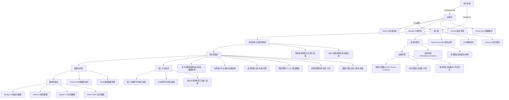

# 客服质检系统需求规格说明书

# 1. 引言

## 1.1 文档目的

本文档旨在明确客服质检系统的全量需求，涵盖系统概述、业务目标、范围界定、技术架构、核心业务流程、功能需求、接口需求、数据需求、部署需求、非功能需求等内容，为系统设计、开发、测试、部署及运维提供标准化依据，确保各方对系统需求达成一致认知，保障系统建设符合业务实际应用场景。

## 1.2 文档范围

本文档覆盖客服质检系统的全部业务模块、技术实现要求、数据规范、部署环境及非功能约束，包括新增的组织架构管理（平台、部门、店铺）、用户管理、角色权限管理模块，以及原有业务模块的适配优化，明确各模块的功能边界、交互逻辑、技术标准，不涉及第三方系统的内部实现细节（仅明确对接规范）。

## 1.3 读者对象

- 产品经理：用于需求梳理、优先级排序及需求落地跟踪，确保产品设计符合需求规范。

- 开发工程师（前端/后端）：作为系统开发的核心依据，明确开发标准、接口规范、目录结构及技术栈要求。

- 测试工程师：用于制定测试计划、设计测试用例，验证系统功能、性能、兼容性等是否符合需求。

- 运维工程师：用于部署系统、配置环境、制定运维策略，保障系统稳定运行。

- 项目管理人员：用于把控项目范围、进度及质量，协调各方资源推进项目落地。

## 1.4 术语与定义

| 术语       | 定义                                                         |
| -------- | ---------------------------------------------------------- |
| RBAC权限控制 | 基于角色的访问控制，通过分配角色给用户，实现细粒度的功能权限和数据权限管理，确保用户仅能访问权限范围内的功能和数据。 |
| AI质检     | 通过调用AI大模型接口，对客服聊天记录进行自动检测，识别违规点、敏感词，给出评分和违规标记，替代部分人工质检工作。  |
| 人工质检     | 由质检人员对AI质检结果进行复核、修正，对不合格聊天记录填写整改意见，确保质检结果的准确性。             |
| 多平台适配    | 系统支持对接多个第三方客服平台及自有后端，实现各平台聊天记录、客服信息的统一采集和管理。               |
| 向量数据库    | 用于存储聊天记录转换后的向量数据，支持相似会话检索，提升数据查询和分析效率（本文档采用Qdrant）。        |
| 组织架构     | 系统的层级结构，包括平台、部门、店铺三个层级，用于实现数据权限隔离和人员管理，支撑多组织协同办公。          |
| 实时关键词检测  | 通过独立客户端工具，对实时聊天数据流进行关键词、敏感词检测，及时推送违规提醒，助力客服规范话术。           |
| 成本均摊     | 根据各分组、店铺、部门的AI调用量，结合计费规则，自动计算各组织的AI使用成本，并按配置比例进行均摊统计。      |

## 1.5 参考文档

- 《个人信息保护法》《网络安全法》

- React官方文档、NestJS官方文档、Prisma官方文档

- 第三方客服平台开放接口文档、AI大模型平台开放接口文档

- 公司内部业务流程规范、数据安全规范

# 2. 系统概述

## 2.1 系统简介

客服质检系统是一款面向企业客服管理场景的综合性系统，基于React+NestJS技术栈开发，实现多平台聊天记录采集、实时关键词检测、AI+人工质检、成本均摊统计、数据可视化等核心功能。新增平台、部门、店铺三级组织架构管理，结合细粒度RBAC权限控制，支持多组织、多角色协同办公，解决客服质检效率低、成本管控难、权限管理混乱等问题，提升客服服务质量和管理效率。

系统支持对接多个第三方客服平台及自有后端，适配不同业务场景的需求；通过AI大模型实现自动化质检，降低人工成本；通过实时检测工具及时发现违规话术，规避服务风险；通过成本均摊统计实现AI使用成本的精细化管控；通过多维度数据可视化，为管理决策提供数据支撑。

## 2.2 业务目标

1. 实现多平台数据统一采集：对接第三方客服平台及自有后端，实现聊天记录、客服信息的自动采集、清洗、存储，打破数据孤岛。

2. 提升质检效率与质量：通过AI自动质检完成80%以上的常规质检任务，人工质检聚焦高风险、高价值会话，质检效率提升50%以上，质检准确率达到95%以上。

3. 实现实时风险管控：通过独立检测工具，实时检测聊天内容中的敏感词、违规关键词，及时推送提醒，降低服务违规风险。

4. 精细化成本管控：实现AI使用成本的按组织（平台/部门/店铺）均摊统计，明确成本归属，优化成本结构，降低运营成本。

5. 规范组织与权限管理：建立三级组织架构，实现细粒度RBAC权限控制，确保数据安全和操作合规，支持多组织协同办公。

6. 提供数据决策支撑：多维度数据统计与可视化，生成周期性报告和自定义报告，为客服管理、流程优化提供数据依据。

## 2.3 系统范围

### 2.3.1 纳入范围

- 组织架构管理：平台管理、部门管理、店铺管理，实现组织信息的增删改查、成员管理、权限隔离。

- 用户与权限管理：用户管理、角色管理、权限管理，实现用户信息管理、角色分配、细粒度权限控制。

- 多平台接口适配：第三方客服平台、自有后端接口适配，实现数据采集、接口状态监控。

- AI平台配置与测试：多AI平台配置、测试、切换，实现AI质检的灵活适配和性能优化。

- 密钥管理：分组/店铺/部门AI密钥的配置、启用/禁用、日志追溯，确保密钥安全。

- 实时关键词检测：独立工具对接、实时数据推送、违规提醒，实现实时风险管控。

- 成本管理：计费规则配置、成本统计、均摊计算、阈值告警，实现精细化成本管控。

- 质检管理：AI质检、人工质检、批量质检、整改跟踪、质检报告，提升质检效率和质量。

- 聊天记录管理：聊天记录查询、筛选、导出、相似会话检索，实现聊天数据的全生命周期管理。

- 标签管理：标签配置、AI匹配规则设置、标签关联，辅助质检和数据分类。

- 数据可视化：核心数据面板、多维度统计、报告生成与导出，提供决策支撑。

- 系统设置：系统参数配置、日志管理、备份与恢复，保障系统稳定运行。

### 2.3.2 排除范围

- 第三方客服平台、AI大模型平台的内部开发、维护及故障处理（仅负责接口对接和异常反馈）。

- 独立关键词检测工具的内部开发（仅负责接口对接和数据交互）。

- 硬件设备的采购、部署及维护（仅明确硬件配置要求）。

- 用户终端设备的适配（仅支持主流浏览器，不兼容特殊终端）。

## 2.4 系统运行环境

### 2.4.1 前端运行环境

- 浏览器：Chrome 110+、Edge 110+、Firefox 100+（主流现代浏览器，不支持IE）。

- 终端设备：台式电脑、笔记本电脑（推荐分辨率1920×1080及以上）。

- 网络环境：带宽≥100Mbps，稳定无丢包，确保实时数据推送和页面加载流畅。

### 2.4.2 后端运行环境

- 服务器系统：Linux CentOS 9+/Ubuntu 22.04+（生产环境）、Windows 10/11（开发/测试环境）。

- 数据库：MySQL 8.0、Redis 8.0、Qdrant 1.12、MinIO 2026.x。

- 运行环境：Node.js 18.x+、Docker、Docker Compose（最新稳定版）。

- 网络环境：带宽≥200Mbps，支持内网穿透（如需对接外部平台），确保接口通信稳定。

# 3. 系统总体设计

## 3.1 系统架构设计

系统采用前后端分离架构，基于React（前端）+NestJS（后端）技术栈，遵循分层设计理念，确保系统的高内聚、低耦合、可扩展、可维护。整体架构分为前端层、接口层、业务逻辑层、数据访问层、数据存储层、第三方对接层，同时新增组织架构与权限控制层，支撑多组织协同和细粒度权限管理。

### 3.1.1 架构分层说明

1. 前端层：基于React 18开发，采用Mantine UI组件库、Zustand状态管理、React Query数据请求与缓存，实现页面渲染、用户交互、权限控制（路由守卫），组件统一管理，确保页面性能和用户体验。

2. 接口层：基于NestJS的Controller层，负责接收前端请求、参数校验（Zod）、返回统一响应格式，实现接口鉴权、路由映射，同时提供Socket.IO实时推送接口，支撑实时数据交互。

3. 组织架构与权限控制层：新增层级，负责组织架构（平台/部门/店铺）的管理、用户角色权限的校验与分配，实现数据行级权限隔离，确保用户仅能访问权限范围内的功能和数据。

4. 业务逻辑层：基于NestJS的Service层，按业务模块划分，负责核心业务逻辑处理，包括数据采集、AI质检、成本计算、质检管理等，实现模块间解耦，便于扩展和维护。

5. 数据访问层：基于Prisma ORM，负责数据库操作（MySQL、Qdrant），实现数据的增删改查、事务管理，同时通过Redis实现数据缓存，提升系统性能。

6. 数据存储层：采用多存储介质协同，MySQL存储结构化业务数据，Redis存储缓存数据，Qdrant存储向量数据，MinIO存储文件数据（报表、备份），确保数据存储的安全性和高效性。

7. 第三方对接层：负责对接第三方客服平台、AI大模型平台、独立关键词检测工具，实现接口适配、数据交互、异常处理，确保系统与外部平台的顺畅对接。

### 3.1.2 系统架构图



## 3.2 技术栈选型

技术栈选型遵循“成熟稳定、性能优越、可扩展、易维护”的原则，结合业务需求和行业最佳实践，适配组织架构管理、细粒度权限控制等新增功能，确保系统长期稳定运行，同时降低开发和维护成本。

### 3.2.1 前端技术栈（全兼容最新版）

| 库                    | 推荐版本     | 用途                                      |
| -------------------- | -------- | --------------------------------------- |
| React                | ^18.3.1  | 前端核心框架，实现页面组件化开发                        |
| TypeScript           | ^5.7.3   | 类型安全，提升代码可维护性和开发效率                      |
| React Router         | ^6.26.2  | 前端路由管理，实现页面跳转和路由守卫                      |
| Zustand              | ^4.5.2   | 轻量级全局状态管理，替代Redux，简化状态管理逻辑              |
| React Query          | ^5.59.13 | 数据请求与缓存管理，自动处理请求重试、状态同步，非必要不使用useEffect |
| Zod                  | ^3.24.1  | 前端表单参数校验，与后端校验规则统一                      |
| Axios                | ^1.7.7   | HTTP请求工具，封装请求拦截、响应拦截，统一处理接口异常           |
| Socket.IO-client     | ^4.8.1   | 实时通信客户端，接收后端推送的实时提醒、任务进度等数据             |
| date-fns             | ^3.6.0   | 日期处理工具，实现日期格式化、范围筛选等功能                  |
| lodash               | ^4.17.21 | 通用工具库，简化数组、对象等数据处理逻辑                    |
| js-cookie            | ^3.0.5   | Cookie管理，存储用户Token、主题配置等信息              |
| crypto-js            | ^4.2.0   | 前端加密工具，实现敏感数据加密传输                       |
| 前后端统一参数校验Schema      | 自定义      | 前后端统一参数校验Schema                         |
| Mantine              | ^7.16.1  | 企业级UI组件库                                |
| ECharts              | ^5.4.3   | 多维度数据图表可视化                              |
| xlsx                 | ^0.18.5  | Excel文件导入导出                             |
| React Bits           | ^1.1.0   | 通用工具组件库                                 |
| TanStack React Table | ^8.20.0  | 高性能数据表格组件                               |

### 3.2.2 后端技术栈（全兼容最新版）

| 库              | 推荐版本     | 用途                                    |
| -------------- | -------- | ------------------------------------- |
| NestJS         | ^10.4.15 | 企业级Node.js后端框架，实现分层架构、模块化开发           |
| TypeScript     | ^5.7.3   | 后端类型安全，提升代码可维护性和开发效率                  |
| Prisma         | ^5.22.0  | 类型安全ORM数据库操作，支持MySQL、PostgreSQL等多种数据库 |
| MySQL          | 8.0      | 核心结构化数据主数据库                           |
| Redis          | 8.0      | 缓存、会话管理、在线状态存储                        |
| Socket.IO      | ^4.8.1   | 实时聊天数据推送、违规提醒                         |
| Zod            | ^3.24.1  | 后端接口参数校验，与前端校验规则统一                    |
| @nestjs/config | ^10.0.3  | 环境变量与配置管理                             |
| Qdrant         | 1.12     | 向量数据库，支持相似会话检索                        |

### 3.2.3 部署与运维技术

| 工具                      | 推荐版本                          | 用途                      |
| ----------------------- | ----------------------------- | ----------------------- |
| 服务器系统                   | Linux CentOS 9+/Ubuntu 22.04+ | 生产环境服务器操作系统             |
| Nginx                   | 1.26+                         | 反向代理、前端静态资源部署、HTTPS配置   |
| Docker + Docker Compose | 最新稳定版                         | 容器化部署、环境统一、快速扩容         |
| Prometheus + Grafana    | 最新稳定版                         | 系统运行状态监控、指标可视化          |
| PM2                     | 5.4+                          | Node.js服务进程管理、负载均衡、自动重启 |

## 3.3 前后端目录结构规范

### 3.3.1 前端目录结构（适配新技术栈）

```text
src/
├── api/                # 按功能模块划分接口请求封装，基于React Query封装
├── components/         # 通用组件+业务组件，统一管理复用
│   ├── ui/             # Mantine基础封装组件
│   ├── business/       # 业务组件（质检、数据面板、组织架构等）
│   └── table/          # TanStack React Table封装组件
├── pages/              # 页面文件，按功能模块划分
│   ├── auth/           # 登录、权限获取页面
│   ├── platform/       # 平台管理页面
│   ├── dept/           # 部门管理页面
│   ├── shop/           # 店铺管理页面
│   ├── user/           # 用户管理页面
│   ├── role/           # 角色权限管理页面
│   └── ...             # 其他业务模块页面
├── hooks/              # 自定义Hooks（useQuery封装、权限Hook等）
├── lib/                # 通用工具库（Zod校验Schema、常量定义）
├── utils/              # 工具函数（日期处理、数据格式化、加密等）
├── store/              # Zustand全局状态管理
├── router/             # React Router路由配置、路由守卫
├── styles/             # 全局样式、Mantine主题配置
├── types/              # TypeScript全局类型定义
└── assets/             # 静态资源（图片、图标、字体）
```

- 核心规范：接口请求统一通过React Query封装，禁止在组件内直接写请求逻辑；非必要不使用useEffect，数据请求与缓存完全通过React Query管理；所有组件统一存放于components文件夹，实现高复用；用户权限从API动态获取，路由守卫根据API返回的权限动态控制页面访问。

### 3.3.2 后端目录结构（适配新技术栈）

```text
src/
├── modules/            # 按业务功能划分模块，模块解耦
│   ├── adapter/        # 多平台接口适配模块（核心新增：数据映射、假数据管理）
│   ├── ai/             # AI平台配置与测试模块
│   ├── key/            # 分组/店铺/部门密钥管理模块
│   ├── cost/           # 成本均摊统计模块
│   ├── quality/        # 质检管理模块
│   ├── chat/           # 聊天记录管理模块
│   ├── tag/            # 标签管理模块
│   ├── platform/       # 平台管理模块（新增）
│   ├── dept/           # 部门管理模块（新增）
│   ├── shop/           # 店铺管理模块（新增）
│   ├── user/           # 用户管理模块（新增）
│   ├── role/           # 角色权限管理模块（新增）
│   └── socket/         # Socket.IO实时推送模块
├── prisma/             # Prisma Schema、迁移文件、客户端
├── common/             # 通用公共模块
│   ├── guards/         # 权限守卫
│   ├── filters/        # 全局异常过滤器
│   ├── middleware/     # 全局中间件
│   ├── decorators/     # 自定义装饰器
│   └── utils/          # 通用工具函数（新增：接口响应统一处理工具）
├── config/             # @nestjs/config配置管理
├── main.ts             # 系统入口文件
└── logs/               # 系统日志分类存储
```

- 核心规范：严格遵循NestJS分层架构，Controller负责请求接收与响应，Service负责业务逻辑，Prisma负责数据库操作；模块间解耦，禁止跨模块强依赖；所有接口参数通过Zod校验，确保类型安全；用户权限从API动态获取，实现细粒度RBAC权限控制；新增接口响应统一处理工具，确保所有平台返回格式一致；多平台适配模块新增数据映射、假数据管理功能，支撑后续平台扩展。

## 3.4 系统交互流程

1. 用户通过浏览器访问前端页面，前端通过React Router路由守卫拦截请求，调用后端权限获取接口，从API动态获取用户信息与权限。

2. 后端权限接口验证用户Token有效性，从数据库查询用户角色、权限、所属组织架构（平台/部门/店铺），返回用户信息与权限列表。

3. 前端接收API返回的用户信息与权限，存储至Zustand全局状态，根据权限动态展示菜单和功能，未授权用户跳转至登录页面。

4. 用户在前端执行操作，前端通过React Query调用后端接口，请求头携带JWT Token进行鉴权，React Query自动处理请求缓存、重试与状态同步。

5. 后端全局中间件拦截请求，校验Token有效性和用户权限，权限通过后将请求转发至对应Controller。

6. Controller通过Zod校验请求参数，调用对应Service层处理核心业务逻辑，Service层通过Prisma操作数据库或调用第三方接口完成数据处理；若涉及多平台数据交互，由adapter模块通过预设映射规则，将第三方数据转换为系统统一格式，若为前期测试，直接返回预设假数据。

7. Service层处理完成后，通过common模块的响应统一处理工具，返回统一格式的响应数据，Controller将响应结果返回给前端，同时通过Socket.IO推送实时数据（如违规提醒、任务进度）。

8. 前端接收响应数据，通过React Query更新缓存，Zustand同步状态，渲染页面内容；接收实时推送数据，触发对应交互（如弹窗提醒、页面刷新）。

9. 用户完成操作后，系统记录操作日志（包括操作人、操作时间、操作内容、所属组织），存储至数据库，便于后续追溯和审计。

# 4. 核心业务流程

核心业务流程围绕“数据采集-质检处理-成本管控-数据可视化”全链路展开，结合组织架构权限隔离，确保各业务模块协同高效，覆盖系统核心应用场景，所有流程均适配平台、部门、店铺三级组织架构，实现数据权限与功能权限的统一管控。重点优化多平台数据映射、接口返回格式统一及假数据使用流程，支撑后续平台快速扩展。

## 4.1 组织架构与权限管理流程

1. 超级管理员登录系统，进入“组织架构管理”模块，先创建平台（录入平台名称、编码、负责人、备注等信息），提交后后端存储平台信息，生成唯一平台ID。

2. 超级管理员/平台负责人在对应平台下，创建部门（关联所属平台，录入部门名称、编码、负责人等信息），支持多级部门创建，形成部门层级结构。

3. 超级管理员/平台负责人/部门负责人在对应部门下，创建店铺（关联所属平台和部门，录入店铺名称、编码、客服团队信息等），完成三级组织架构搭建。

4. 管理员进入“用户管理”模块，创建用户（关联所属平台、部门、店铺，录入用户名、密码、手机号等信息），密码经过加密处理后存储，禁止明文存储。

5. 管理员进入“角色管理”模块，创建角色（如超级管理员、平台管理员、部门管理员、质检人员、客服人员），为每个角色分配功能权限（如接口配置、质检操作、成本查看）和数据权限（如仅查看本部门数据）。

6. 管理员为用户分配对应角色，一个用户可分配多个角色，权限取角色权限的并集；用户登录后，系统根据其所属组织和角色权限，动态展示可访问的功能和数据。

7. 当组织架构（平台/部门/店铺）或角色权限发生变更时，管理员修改对应信息，系统实时更新权限配置，用户重新登录后生效，同时记录变更日志，便于追溯。

## 4.2 多平台接口适配流程（重点优化）

1. 管理员（具备接口配置权限）进入“多平台接口适配”模块，选择需要对接的第三方客服平台或自有后端，录入接口基础信息（接口名称、接口地址、请求方式、请求头、鉴权参数），关联对应组织架构。

2. 核心步骤：管理员配置平台数据映射规则，明确第三方接口返回数据与系统内部数据的对应关系（如第三方聊天记录ID与系统会话ID的映射、客服ID的映射、会话时间格式映射等），每个平台单独配置映射规则，存储至系统配置表，后续新增平台仅需新增对应映射规则，无需修改核心代码。

前期测试配置：管理员勾选“启用假数据模式”，系统自动加载该平台对应的预设假数据（模拟第三方接口返回格式），假数据按系统统一数据格式配置，与真实数据结构一致，便于前期开发测试，无需依赖第三方平台接口；假数据支持自定义修改，可根据测试场景调整数据内容，后续切换为真实数据时，仅需取消“假数据模式”，无需修改代码。

1. 接口适配测试：管理员发起接口测试，系统根据配置的接口信息和映射规则，调用第三方接口（或返回假数据），验证数据采集、格式转换是否正常，接口响应是否符合系统统一格式，测试结果实时展示，支持异常排查（如接口调用失败、映射规则错误等）。

2. 接口状态监控：系统实时监控已配置接口的运行状态（在线/离线）、响应耗时、调用成功率，当接口出现异常（如离线、响应超时、调用失败率过高）时，自动推送告警信息（系统通知、邮件）给管理员，便于及时处理。

3. 新增平台适配：后续新增第三方客服平台或自有后端时，管理员仅需在“多平台接口适配”模块新增接口配置和对应的数据映射规则，启用假数据模式完成前期测试，无需改动系统核心代码，实现快速适配。

## 4.3 AI平台配置与质检流程

1. 管理员进入“AI平台配置”模块，新增AI大模型平台配置（录入平台名称、接口地址、鉴权密钥、调用计费规则等），支持多AI平台配置，可设置默认AI平台，也可根据组织架构（平台/部门/店铺）分配不同的AI平台。

2. 密钥管理关联：管理员将AI平台密钥与对应组织（平台/部门/店铺）关联，密钥支持启用/禁用状态切换，禁用后该组织无法调用对应AI平台接口；系统记录密钥的配置、修改、禁用日志，便于追溯和安全审计。

3. AI质检规则配置：管理员配置AI质检规则，包括敏感词库、违规场景（如态度恶劣、答非所问、泄露隐私）、评分标准、标签匹配规则等，规则可按组织架构细分，不同平台/部门可配置差异化规则。

4. AI质检执行：系统自动采集各平台聊天记录（真实数据或假数据），按配置的AI平台和质检规则，调用AI接口进行自动质检，识别违规点、敏感词，生成质检评分、违规标记和质检报告，存储至数据库。

5. 人工质检复核：质检人员进入“人工质检”模块，查看AI质检结果，对AI误判、漏判的会话进行复核、修正，填写整改意见，标记质检状态（未复核、已复核、需整改），整改意见同步至对应客服人员。

6. 质检结果反馈：系统将质检结果（AI+人工）反馈至对应组织（平台/部门/店铺）负责人，便于查看本组织客服服务质量，针对高频违规问题优化客服话术和培训内容。

## 4.4 成本均摊统计流程

1. 管理员进入“成本管理”模块，配置AI调用计费规则（如按调用次数计费、按会话时长计费），支持按组织架构（平台/部门/店铺）设置差异化计费规则，关联对应AI平台的计费标准。

2. 成本数据采集：系统实时统计各组织（平台/部门/店铺）的AI调用量（调用次数、会话时长等），结合计费规则，自动计算各组织的AI使用成本，数据来源包括真实AI调用记录和假数据测试调用记录（可单独标记，不纳入实际成本统计）。

3. 成本均摊计算：管理员配置成本均摊规则（如按组织人数、业务量、调用量比例均摊），系统按规则自动将总AI成本均摊至各组织，生成成本均摊报表，明确各组织的成本归属。

4. 成本阈值告警：管理员设置成本阈值（总阈值、各组织阈值），当某组织AI使用成本达到阈值的80%时，系统推送预警信息；达到阈值时，推送告警信息，提醒管理员和组织负责人控制成本。

5. 成本报表生成：系统定期（日/周/月）生成成本统计报表和均摊报表，支持导出Excel格式，便于管理员查看、分析成本结构，优化AI使用策略，降低运营成本。

## 4.5 聊天记录与标签管理流程

1. 聊天记录采集与存储：系统通过多平台接口适配模块，自动采集各平台聊天记录（真实数据或假数据），经过清洗、格式转换（按统一映射规则）后，存储至MySQL数据库，同时将聊天记录转换为向量数据，存储至Qdrant向量数据库，用于相似会话检索。

2. 聊天记录查询与筛选：用户（按权限）进入“聊天记录管理”模块，可通过组织架构（平台/部门/店铺）、时间范围、客服人员、会话ID、关键词等条件，查询聊天记录，支持模糊查询和精准筛选，查看会话详情（发送方、接收方、发送时间、消息内容）。

3. 相似会话检索：用户输入会话关键词或选择某条会话，系统通过Qdrant向量数据库检索相似会话，展示检索结果（相似度排序），便于质检人员排查同类违规问题，优化质检规则。

4. 标签管理配置：管理员进入“标签管理”模块，创建质检标签（如“态度恶劣”“泄露隐私”“答非所问”），配置标签的AI匹配规则（如包含特定关键词、符合特定语义），标签可关联违规场景和质检评分。

5. 标签关联与应用：AI质检时，系统根据标签匹配规则，自动为聊天记录关联对应标签；人工质检时，质检人员可手动为会话添加、修改标签，标签关联的会话数据用于后续统计分析和客服培训。

## 4.6 实时关键词检测流程

1. 管理员进入“实时关键词检测”模块，配置敏感词、违规关键词库，支持按组织架构细分关键词库，不同平台/部门可配置差异化关键词，关键词支持新增、修改、删除，实时生效。

2. 接口对接配置：管理员配置独立关键词检测工具的接口信息，实现系统与工具的对接，确保实时聊天数据流能够同步至检测工具。

3. 实时检测与提醒：独立检测工具实时接收各平台聊天数据流（真实数据或假数据），对消息内容进行关键词检测，当检测到敏感词、违规关键词时，立即通过Socket.IO向系统推送违规提醒，提醒信息包含会话ID、发送方、违规关键词、所属组织等内容。

4. 违规处理：客服人员接收违规提醒后，及时调整话术，纠正违规行为；质检人员和管理员可查看实时违规记录，跟踪违规处理情况，对高频违规关键词和客服人员进行重点管控和培训。

## 4.7 数据可视化与报告流程

1. 核心数据面板配置：管理员配置核心数据面板，展示各组织（平台/部门/店铺）的关键指标（AI质检率、质检合格率、违规率、AI调用量、成本统计、客服在线人数等），支持按组织层级切换查看，数据实时更新。

2. 多维度统计分析：系统支持按时间（日/周/月/季度/年）、组织架构、客服人员、违规类型等维度，对质检数据、成本数据、聊天记录数据进行统计分析，生成柱状图、折线图、饼图等可视化图表。

3. 报告生成与导出：系统支持生成周期性报告（日/周/月/季度/年）和自定义报告，报告包含关键指标统计、数据趋势分析、违规问题总结、成本分析等内容，支持导出Excel、PDF格式，便于管理员汇报和存档。

4. 数据决策支撑：管理员通过数据可视化图表和报告，分析客服服务质量、AI使用效率、成本结构等，识别存在的问题，优化质检规则、AI配置和客服培训方案，为管理决策提供数据依据。

## 4.8 系统设置与运维流程

1. 系统参数配置：管理员进入“系统设置”模块，配置系统基础参数（如会话超时时间、数据保留期限、告警推送方式、密码加密规则等），参数修改后实时生效，支持参数备份和恢复。

2. 日志管理：系统记录所有操作日志（用户登录、功能操作、参数修改、接口调用、异常信息等），日志包含操作人、操作时间、操作内容、所属组织、操作结果等信息，支持按条件查询、筛选、导出，便于审计和故障排查。

3. 数据备份与恢复：管理员配置自动备份策略（如每日凌晨备份），备份内容包括数据库数据、配置文件、日志文件等，备份文件存储至MinIO，支持手动备份和恢复；当系统出现数据丢失、故障时，可通过备份文件恢复数据，确保数据安全。

4. 系统运维监控：运维人员通过Prometheus+Grafana监控系统运行状态（服务器CPU、内存、磁盘使用率，接口响应耗时，数据库性能等），设置监控阈值，当出现异常时，系统推送告警信息，运维人员及时处理，保障系统稳定运行。

# 5. 功能需求

功能需求按业务模块划分，明确各模块的具体功能点、操作权限、交互逻辑，所有功能均适配平台、部门、店铺三级组织架构，实现细粒度RBAC权限控制，同时满足多平台数据映射、接口统一、假数据使用及可扩展性要求，确保功能贴合业务实际需求。

## 5.1 组织架构管理模块

### 5.1.1 平台管理

- 权限控制：仅超级管理员、平台负责人可操作，普通用户仅可查看所属平台信息。

- 核心功能：平台新增（录入名称、编码、负责人、备注，编码唯一）、修改、删除（删除前需确认无关联部门、店铺和用户）、查询、详情查看。

- 附加功能：平台负责人分配（可关联已创建用户）、平台状态切换（启用/禁用，禁用后该平台下所有功能不可用）、平台信息导出。

### 5.1.2 部门管理

- 权限控制：超级管理员、平台负责人、部门负责人可操作，普通用户仅可查看所属部门信息。

- 核心功能：部门新增（关联所属平台，录入名称、编码、负责人、备注，编码在所属平台内唯一）、修改、删除（删除前需确认无关联店铺和用户）、查询、详情查看，支持多级部门创建（最多5级）。

- 附加功能：部门负责人分配、部门状态切换、部门层级调整、部门信息导出。

### 5.1.3 店铺管理

- 权限控制：超级管理员、平台负责人、部门负责人可操作，普通用户仅可查看所属店铺信息。

- 核心功能：店铺新增（关联所属平台和部门，录入名称、编码、客服团队信息、备注，编码在所属部门内唯一）、修改、删除（删除前需确认无关联用户）、查询、详情查看。

- 附加功能：店铺负责人分配、店铺状态切换、店铺信息导出、客服团队关联（关联已创建的客服用户）。

## 5.2 用户与权限管理模块

### 5.2.1 用户管理

- 权限控制：超级管理员、平台负责人、部门负责人可操作（仅可管理所属组织内的用户）。

- 核心功能：用户新增（关联所属平台、部门、店铺，录入用户名、密码、手机号、邮箱，用户名唯一）、修改、删除、查询、详情查看、密码重置（重置为默认密码，需用户登录后修改）。

- 附加功能：用户状态切换（启用/禁用，禁用后无法登录系统）、用户角色分配、用户操作日志查看、用户信息导出。

- 安全要求：密码采用加密存储（crypto-js），禁止明文存储；用户登录失败次数限制（连续5次失败，锁定账号1小时）。

### 5.2.2 角色管理

- 权限控制：仅超级管理员可创建、删除角色，平台负责人、部门负责人可创建所属组织内的自定义角色。

- 核心功能：角色新增（录入角色名称、描述，区分系统角色和自定义角色）、修改、删除（删除前需确认无关联用户）、查询、详情查看。

- 权限分配：为角色分配功能权限（如接口配置、质检操作、成本查看）和数据权限（如仅查看本部门数据、查看全平台数据），权限分配支持批量操作，实时生效。

- 附加功能：角色复制（快速创建相似权限的角色）、角色权限导出、角色关联用户查看。

### 5.2.3 权限管理

- 权限控制：仅超级管理员可管理全局权限，平台负责人、部门负责人可管理所属组织内的权限。

- 核心功能：权限新增（按功能模块划分，如组织架构管理、AI配置、质检管理等）、修改、删除、查询，支持权限分组管理。

- 权限校验：系统所有功能操作均需进行权限校验，未授权用户无法访问对应功能，路由守卫拦截未授权请求，跳转至登录页面。

- 附加功能：权限关联角色查看、权限日志查看（记录权限的新增、修改、删除操作）。

## 5.3 多平台接口适配模块

### 5.3.1 接口配置

- 权限控制：仅超级管理员、平台负责人、具备接口配置权限的角色可操作。

- 核心功能：接口新增（选择对接类型：第三方客服平台/自有后端，录入接口名称、接口地址、请求方式、请求头、鉴权参数，关联所属组织架构）、修改、删除、查询、详情查看。

- 附加功能：接口状态切换（启用/禁用，禁用后不再采集该接口数据）、接口参数导出、接口配置备份。

### 5.3.2 数据映射管理

- 权限控制：仅超级管理员、平台负责人、具备接口配置权限的角色可操作。

- 核心功能：映射规则新增（关联对应平台接口，配置第三方数据与系统内部数据的对应关系，支持字段映射、格式转换映射，如时间格式、字段名称映射）、修改、删除、查询、详情查看。

- 附加功能：映射规则测试（验证映射效果，支持输入第三方数据样例，查看转换后的系统统一格式数据）、映射规则导出、批量导入映射规则（便于新增平台快速配置）。

### 5.3.3 假数据管理

- 权限控制：仅超级管理员、平台负责人、具备接口配置权限的角色可操作。

- 核心功能：假数据新增（关联对应平台接口，按系统统一数据格式录入假数据，模拟第三方接口返回内容）、修改、删除、查询、详情查看，支持批量导入/导出假数据。

- 附加功能：假数据模式切换（启用/禁用，启用后系统优先使用假数据，禁用后切换为真实接口数据）、假数据场景配置（按测试需求配置不同场景的假数据）。

### 5.3.4 接口监控

- 权限控制：超级管理员、平台负责人、具备接口配置权限的角色可查看，运维人员可操作告警配置。

- 核心功能：实时展示接口运行状态（在线/离线）、响应耗时、调用成功率、今日调用次数，支持按组织、接口类型筛选查看。

- 告警功能：支持配置接口异常告警阈值（如响应耗时超过500ms、调用失败率超过10%），告警方式支持系统通知、邮件，告警记录可查询、筛选、导出。

## 5.4 AI平台配置与测试模块

### 5.4.1 AI平台配置

- 权限控制：仅超级管理员、平台负责人可操作。

- 核心功能：AI平台新增（录入平台名称、接口地址、鉴权密钥、计费规则、备注）、修改、删除、查询、详情查看，支持设置默认AI平台。

- 附加功能：AI平台状态切换（启用/禁用，禁用后无法调用该平台接口）、AI平台密钥加密存储、密钥修改日志查看。

### 5.4.2 AI密钥管理

- 权限控制：超级管理员、平台负责人、部门负责人可操作（仅可管理所属组织的密钥）。

- 核心功能：密钥关联（将AI平台密钥与所属组织/店铺/部门关联）、密钥启用/禁用、密钥修改、密钥查询、密钥详情查看。

- 附加功能：密钥使用日志查看（记录密钥的调用时间、调用组织、调用次数）、密钥批量关联/解绑。

### 5.4.3 AI质检规则配置

- 权限控制：超级管理员、平台负责人、具备质检权限的角色可操作。

- 核心功能：质检规则新增（录入规则名称、关联组织、敏感词库、违规场景、评分标准、标签匹配规则）、修改、删除、查询、详情查看，支持按组织细分规则。

- 附加功能：规则测试（输入聊天记录样例，查看AI质检结果，验证规则有效性）、规则启用/禁用、规则导出/导入、规则复制。

### 5.4.4 AI平台测试

- 权限控制：超级管理员、平台负责人、具备AI配置权限的角色可操作。

- 核心功能：发起AI测试（选择AI平台、输入测试文本/聊天记录，设置测试规则），查看测试结果（质检评分、违规标记、标签关联），对比不同AI平台的测试效果。

- 附加功能：测试记录查询、筛选、导出，测试结果对比分析（生成对比报表）。

## 5.5 质检管理模块

### 5.5.1 AI质检

- 权限控制：所有具备质检权限的用户可查看，系统自动执行，无需手动操作。

- 核心功能：系统自动采集各平台聊天记录（真实数据/假数据），调用AI平台接口进行质检，生成质检结果（评分、违规点、敏感词、标签），存储至数据库，支持按组织、时间、客服人员筛选查看AI质检结果。

- 附加功能：AI质检结果批量导出、AI误判反馈（质检人员可标记误判结果，优化AI质检规则）、质检进度查看。

### 5.5.2 人工质检

- 权限控制：仅具备人工质检权限的用户可操作。

- 核心功能：查看AI质检结果，对未复核的会话进行复核，修正AI误判、漏判的违规点和标签，填写整改意见，标记质检状态（未复核、已复核、需整改），支持批量复核。

- 附加功能：整改意见推送（同步至对应客服人员）、整改结果跟踪（查看客服整改情况）、人工质检记录查询、筛选、导出。

### 5.5.3 批量质检

- 权限控制：仅具备批量质检权限的用户可操作。

- 核心功能：选择批量质检范围（按组织、时间、客服人员、会话类型筛选），设置质检规则（AI质检/人工质检），发起批量质检任务，查看任务进度和结果，支持任务暂停、取消。

- 附加功能：批量质检结果导出、任务日志查看（记录任务发起时间、执行进度、结果）。

### 5.5.4 质检报告

- 权限控制：超级管理员、平台负责人、部门负责人、具备质检权限的用户可查看（按权限查看对应组织的报告）。

- 核心功能：系统自动生成AI质检报告、人工质检报告，包含质检合格率、违规率、高频违规类型、客服评分排名等内容，支持按时间（日/周/月/季度/年）、组织筛选查看。

- 附加功能：报告导出（Excel、PDF格式）、报告打印、自定义报告生成（选择统计维度和指标）。

## 5.6 成本管理模块

### 5.6.1 计费规则配置

- 权限控制：仅超级管理员、平台负责人可操作。

- 核心功能：计费规则新增（录入规则名称、关联AI平台、计费方式（按调用次数/会话时长）、单价、关联组织）、修改、删除、查询、详情查看，支持按组织配置差异化计费规则。

- 附加功能：计费规则启用/禁用、规则导出/导入、规则生效时间设置。

### 5.6.2 成本统计

- 权限控制：超级管理员、平台负责人、部门负责人可查看（按权限查看对应组织的成本数据）。

- 核心功能：实时统计各组织（平台/部门/店铺）的AI使用成本（按计费规则计算），展示成本明细（调用次数、时长、单价、总成本），支持按时间、组织、AI平台筛选查看。

- 附加功能：成本数据导出、成本趋势分析（生成折线图，展示成本变化趋势）、成本对比（不同组织、不同时间段成本对比）。

### 5.6.3 成本均摊

- 权限控制：仅超级管理员、平台负责人可操作。

- 核心功能：均摊规则配置（录入规则名称、均摊方式（按人数/业务量/调用量比例）、关联组织），系统按规则自动计算各组织的均摊成本，生成均摊报表。

- 附加功能：均摊报表导出、均摊规则修改、均摊结果查看（明细和汇总）。

### 5.6.4 成本告警

- 权限控制：超级管理员、平台负责人、部门负责人可查看和配置（仅可配置所属组织的告警阈值）。

- 核心功能：设置成本告警阈值（总阈值、各组织阈值），当成本达到阈值的80%时推送预警，达到阈值时推送告警，支持配置告警接收人、告警方式（系统通知、邮件）。

- 附加功能：告警记录查询、筛选、导出，告警阈值修改日志查看。

## 5.7 聊天记录管理模块

### 5.7.1 聊天记录采集与存储

- 权限控制：系统自动执行，无需手动操作，管理员可查看采集状态。

- 核心功能：系统通过多平台接口适配模块，自动采集各平台聊天记录，经过清洗、格式转换（按映射规则）后，存储至MySQL数据库，同时转换为向量数据存储至Qdrant，支持设置数据保留期限（自动清理过期数据）。

- 附加功能：采集状态查看（成功/失败）、采集失败重试、采集日志查看。

### 5.7.2 聊天记录查询与筛选

- 权限控制：用户按权限查看对应组织的聊天记录（客服人员仅可查看自己的聊天记录，质检人员可查看所属组织的所有聊天记录）。

- 核心功能：支持按组织（平台/部门/店铺）、时间范围、客服人员、会话ID、关键词、标签等条件，进行模糊查询和精准筛选，查看会话详情（发送方、接收方、发送时间、消息内容、质检状态）。

- 附加功能：聊天记录分页展示、会话详情导出、聊天记录复制。

### 5.7.3 相似会话检索

- 权限控制：具备质检权限、管理员权限的用户可操作。

- 核心功能：输入会话关键词或选择某条会话，系统通过Qdrant向量数据库检索相似会话，按相似度排序展示，支持查看相似会话详情，筛选相似会话的时间范围、组织。

- 附加功能：相似会话导出、检索结果保存。

## 5.8 标签管理模块

### 5.8.1 标签配置

- 权限控制：仅超级管理员、平台负责人、具备标签管理权限的角色可操作。

- 核心功能：标签新增（录入标签名称、描述、关联违规场景、关联质检评分）、修改、删除、查询、详情查看，支持标签分组管理（如违规类、服务类标签）。

- 附加功能：标签启用/禁用、标签导出/导入、标签批量操作。

### 5.8.2 标签匹配规则

- 权限控制：仅超级管理员、平台负责人、具备标签管理权限的角色可操作。

- 核心功能：为标签配置匹配规则（如包含特定关键词、符合特定语义、关联特定违规场景），支持多规则组合，规则可按组织细分。

- 附加功能：规则测试（输入聊天记录样例，验证标签匹配效果）、规则修改、规则导出/导入。

### 5.8.3 标签关联与管理

- 权限控制：AI自动关联标签，质检人员可手动修改，具备标签管理权限的用户可查看标签关联记录。

- 核心功能：AI质检时自动为聊天记录关联对应标签，人工质检时可手动添加、修改、删除标签，支持批量为会话关联标签。

- 附加功能：标签关联记录查询（按标签、组织、时间筛选）、标签使用统计（展示各标签的关联次数）。

## 5.9 实时关键词检测模块

### 5.9.1 关键词库配置

- 权限控制：仅超级管理员、平台负责人、具备关键词管理权限的角色可操作。

- 核心功能：关键词新增（录入关键词、关键词类型（敏感词/违规词）、关联组织、备注）、修改、删除、查询，支持批量导入/导出关键词，支持按组织配置差异化关键词库。

- 附加功能：关键词启用/禁用、关键词分组管理、关键词搜索。

### 5.9.2 检测工具对接

- 权限控制：仅超级管理员、运维人员可操作。

- 核心功能：配置独立关键词检测工具的接口信息（接口地址、鉴权参数、推送方式），测试接口连通性，确保实时聊天数据流能够同步至检测工具。

- 附加功能：接口状态监控、接口参数修改、对接日志查看。

### 5.9.3 实时检测与提醒

- 权限控制：客服人员可接收提醒，管理员、质检人员可查看所有违规提醒记录。

- 核心功能：检测工具实时检测聊天内容，发现违规关键词后，通过Socket.IO推送提醒至对应客服人员和管理员，提醒信息包含会话ID、发送方、违规关键词、所属组织、时间。

- 附加功能：提醒记录查询、筛选、导出，提醒设置（如提醒频率、接收人）。

## 5.10 数据可视化模块

### 5.10.1 核心数据面板

- 权限控制：用户按权限查看对应组织的核心数据（普通用户仅可查看个人相关数据，管理员可查看全组织数据）。

- 核心功能：展示关键指标（AI质检率、质检合格率、违规率、AI调用量、成本统计、客服在线人数、会话总量），支持按组织层级（平台/部门/店铺）切换查看，数据实时更新，图表化展示（柱状图、折线图、饼图）。

- 附加功能：指标筛选（按时间范围筛选）、图表导出、面板自定义（选择展示的指标和图表类型）。

### 5.10.2 多维度统计分析

- 权限控制：管理员、质检人员、组织负责人可操作（按权限查看对应组织的数据）。

- 核心功能：支持按时间（日/周/月/季度/年）、组织、客服人员、违规类型、标签等维度，对质检数据、成本数据、聊天记录数据进行统计分析，生成可视化图表，支持图表交互（如点击查看明细）。

- 附加功能：统计结果导出、自定义统计维度、统计数据对比（不同时间段、不同组织对比）。

### 5.10.3 报告生成与导出

- 权限控制：管理员、组织负责人、质检人员可操作（按权限生成对应组织的报告）。

- 核心功能：自动生成周期性报告（日/周/月/季度/年），支持自定义报告（选择统计维度、指标、时间范围），报告包含数据统计、趋势分析、问题总结、建议等内容。

- 附加功能：报告导出（Excel、PDF格式）、报告打印、报告分享（发送至指定邮箱）。

## 5.11 系统设置模块

### 5.11.1 系统参数配置

- 权限控制：仅超级管理员、运维人员可操作。

- 核心功能：配置系统基础参数（会话超时时间、数据保留期限、告警推送方式、密码加密规则、登录失败次数限制、接口超时时间），参数修改后实时生效，支持参数备份和恢复。

- 附加功能：参数修改日志查看、默认参数重置。

### 5.11.2 日志管理

- 权限控制：超级管理员、运维人员可查看和操作，普通用户仅可查看自己的操作日志。

- 核心功能：记录所有系统操作日志（用户登录、功能操作、参数修改、接口调用、异常信息等），日志包含操作人、操作时间、操作内容、所属组织、操作结果，支持按条件查询、筛选、导出。

- 附加功能：日志清理（按时间范围清理过期日志）、日志备份、异常日志标记和排查。

### 5.11.3 备份与恢复

- 权限控制：仅超级管理员、运维人员可操作。

- 核心功能：配置自动备份策略（备份时间、备份频率、备份内容），支持手动备份，备份文件存储至MinIO；当系统出现数据丢失、故障时，可通过备份文件恢复数据（全量恢复、增量恢复）。

- 附加功能：备份文件查询、删除、下载，恢复日志查看（记录恢复时间、恢复内容、恢复结果）。

# 6. 接口需求

接口需求明确系统所有接口的请求方式、请求参数、响应格式、权限要求，重点实现接口返回格式统一、多平台数据映射、假数据支持，确保接口的可扩展性、安全性和兼容性，后续新增平台仅需新增对应接口配置和映射规则，无需修改核心接口代码。

## 6.1 接口通用规范

### 6.1.1 响应格式统一

所有接口返回格式统一，包含状态码、提示信息、数据体，支持分页数据统一格式，具体如下：

```json
{
  "code": 200, // 状态码：200成功，400参数错误，401未授权，403权限不足，404资源不存在，500服务器异常
  "message": "操作成功", // 提示信息
  "data": {}, // 数据体（单个数据/列表数据/分页数据）
  "pageInfo": { // 分页数据（列表接口必传）
    "pageNum": 1, // 当前页码
    "pageSize": 10, // 每页条数
    "total": 100, // 总条数
    "totalPage": 10 // 总页数
  },
  "timestamp": 1699999999999 // 响应时间戳
}
```

### 6.1.2 请求规范

- 请求方式：GET（查询）、POST（新增）、PUT（修改）、DELETE（删除），严格遵循RESTful规范。

- 请求头：所有接口需携带Authorization请求头（JWT Token），用于身份鉴权；Content-Type统一为application/json（POST/PUT请求）。

- 参数校验：所有接口请求参数需通过Zod校验，校验失败返回400状态码和具体错误提示。

- 编码格式：统一使用UTF-8编码，避免中文乱码。

### 6.1.3 权限规范

- 接口鉴权：所有接口均需进行Token校验，未携带Token或Token无效，返回401未授权。

- 数据权限：接口返回数据需根据用户所属组织和角色权限进行过滤，确保用户仅能获取权限范围内的数据。

- 操作权限：不同角色用户可访问的接口不同，未具备对应操作权限的用户访问接口，返回403权限不足。

### 6.1.4 异常处理规范

- 接口异常统一由全局异常过滤器处理，返回统一格式的错误响应，包含错误状态码和具体错误信息。

- 常见异常：参数错误、权限不足、资源不存在、接口调用失败、数据库操作异常等，均需返回对应状态码和明确提示。

- 异常日志：所有接口异常均需记录日志，包含请求参数、异常信息、操作人、操作时间，便于故障排查。

## 6.2 组织架构管理接口

### 6.2.1 平台管理接口

- 新增平台：POST /api/platform，请求参数（name、code、managerId、remark），权限（超级管理员、平台负责人）。

- 修改平台：PUT /api/platform/{id}，请求参数（name、code、managerId、remark、status），权限（超级管理员、平台负责人）。

- 删除平台：DELETE /api/platform/{id}，权限（超级管理员）。

- 查询平台列表：GET /api/platform/list，请求参数（pageNum、pageSize、name、code、status），权限（所有登录用户）。

- 查询平台详情：GET /api/platform/{id}，权限（所有登录用户）。

### 6.2.2 部门管理接口

- 新增部门：POST /api/dept，请求参数（name、code、platformId、parentId、managerId、remark），权限（超级管理员、平台负责人）。

- 修改部门：PUT /api/dept/{id}，请求参数（name、code、parentId、managerId、remark、status），权限（超级管理员、平台负责人、部门负责人）。

- 删除部门：DELETE /api/dept/{id}，权限（超级管理员、平台负责人）。

- 查询部门列表：GET /api/dept/list，请求参数（pageNum、pageSize、platformId、name、code、status），权限（所有登录用户）。

- 查询部门详情：GET /api/dept/{id}，权限（所有登录用户）。

### 6.2.3 店铺管理接口

- 新增店铺：POST /api/shop，请求参数（name、code、platformId、deptId、managerId、serviceTeam、remark），权限（超级管理员、平台负责人、部门负责人）。

- 修改店铺：PUT /api/shop/{id}，请求参数（name、code、deptId、managerId、serviceTeam、remark、status），权限（超级管理员、平台负责人、部门负责人）。

- 删除店铺：DELETE /api/shop/{id}，权限（超级管理员、平台负责人）。

- 查询店铺列表：GET /api/shop/list，请求参数（pageNum、pageSize、platformId、deptId、name、code、status），权限（所有登录用户）。

- 查询店铺详情：GET /api/shop/{id}，权限（所有登录用户）。

## 6.3 用户与权限管理接口

### 6.3.1 用户管理接口

- 新增用户：POST /api/user，请求参数（username、password、phone、email、platformId、deptId、shopId、status），权限（超级管理员、平台负责人、部门负责人）。

- 修改用户：PUT /api/user/{id}，请求参数（username、phone、email、platformId、deptId、shopId、status），权限（超级管理员、平台负责人、部门负责人）。

- 删除用户：DELETE /api/user/{id}，权限（超级管理员、平台负责人）。

- 查询用户列表：GET /api/user/list，请求参数（pageNum、pageSize、platformId、deptId、shopId、username、status），权限（超级管理员、平台负责人、部门负责人）。

- 查询用户详情：GET /api/user/{id}，权限（超级管理员、平台负责人、部门负责人、用户本人）。

- 密码重置：PUT /api/user/{id}/reset-password，请求参数（newPassword），权限（超级管理员、平台负责人、部门负责人）。

### 6.3.2 角色管理接口

- 新增角色：POST /api/role，请求参数（name、description、platformId、deptId、isSystem），权限（超级管理员、平台负责人）。

- 修改角色：PUT /api/role/{id}，请求参数（name、description、status），权限（超级管理员、平台负责人）。

- 删除角色：DELETE /api/role/{id}，权限（超级管理员）。

- 查询角色列表：GET /api/role/list，请求参数（pageNum、pageSize、platformId、deptId、name、status），权限（超级管理员、平台负责人、部门负责人）。

- 角色权限分配：POST /api/role/{id}/assign-permission，请求参数（permissionIds），权限（超级管理员、平台负责人）。

### 6.3.3 权限管理接口

- 新增权限：POST /api/permission，请求参数（name、code、parentId、description、type），权限（超级管理员）。

- 修改权限：PUT /api/permission/{id}，请求参数（name、code、parentId、description、status），权限（超级管理员）。

- 删除权限：DELETE /api/permission/{id}，权限（超级管理员）。

- 查询权限列表：GET /api/permission/list，请求参数（pageNum、pageSize、name、code、type），权限（超级管理员、平台负责人）。

## 6.4 多平台接口适配接口

### 6.4.1 接口配置接口

- 新增接口配置：POST /api/adapter/interface，请求参数（name、type、url、method、headers、authParams、platformId、deptId、status），权限（超级管理员、平台负责人、具备接口配置权限的角色）。

- 修改接口配置：PUT /api/adapter/interface/{id}，请求参数（name、type、url、method、headers、authParams、status），权限（超级管理员、平台负责人、具备接口配置权限的角色）。

- 删除接口配置：DELETE /api/adapter/interface/{id}，权限（超级管理员、平台负责人）。

- 查询接口配置列表：GET /api/adapter/interface/list，请求参数（pageNum、pageSize、platformId、deptId、type、name、status），权限（超级管理员、平台负责人、具备接口配置权限的角色）。

- 测试接口连通性：POST /api/adapter/interface/{id}/test，权限（超级管理员、平台负责人、具备接口配置权限的角色）。

### 6.4.2 数据映射接口

- 新增映射规则：POST /api/adapter/mapping，请求参数（interfaceId、thirdPartyFields、systemFields、formatMapping、remark），权限（超级管理员、平台负责人、具备接口配置权限的角色）。

- 修改映射规则：PUT /api/adapter/mapping/{id}，请求参数（interfaceId、thirdPartyFields、systemFields、formatMapping、remark、status），权限（超级管理员、平台负责人、具备接口配置权限的角色）。

- 删除映射规则：DELETE /api/adapter/mapping/{id}，权限（超级管理员、平台负责人）。

- 查询映射规则列表：GET /api/adapter/mapping/list，请求参数（pageNum、pageSize、interfaceId、platformId、deptId），权限（超级管理员、平台负责人、具备接口配置权限的角色）。

- 测试映射规则：POST /api/adapter/mapping/{id}/test，请求参数（thirdPartyData），权限（超级管理员、平台负责人、具备接口配置权限的角色）。

### 6.4.3 假数据管理接口

- 新增假数据：POST /api/adapter/fake-data，请求参数（interfaceId、fakeData、scene、remark、status），权限（超级管理员、平台负责人、具备接口配置权限的角色）。

- 修改假数据：PUT /api/adapter/fake-data/{id}，请求参数（fakeData、scene、remark、status），权限（超级管理员、平台负责人、具备接口配置权限的角色）。

- 删除假数据：DELETE /api/adapter/fake-data/{id}，权限（超级管理员、平台负责人）。

- 查询假数据列表：GET /api/adapter/fake-data/list，请求参数（pageNum、pageSize、interfaceId、platformId、scene、status），权限（超级管理员、平台负责人、具备接口配置权限的角色）。

- 批量导入假数据：POST /api/adapter/fake-data/batch-import，请求参数（interfaceId、fakeDataList），权限（超级管理员、平台负责人、具备接口配置权限的角色）。

- 切换假数据模式：PUT /api/adapter/fake-data/switch-mode，请求参数（interfaceId、enableFakeData），权限（超级管理员、平台负责人、具备接口配置权限的角色）。

### 6.4.4 接口监控接口

- 查询接口监控列表：GET /api/adapter/monitor/list，请求参数（pageNum、pageSize、platformId、deptId、interfaceId、status），权限（超级管理员、平台负责人、具备接口配置权限的角色、运维人员）。

- 查询接口监控详情：GET /api/adapter/monitor/{id}，请求参数（interfaceId），权限（超级管理员、平台负责人、具备接口配置权限的角色、运维人员）。

- 配置接口告警：POST /api/adapter/monitor/alarm，请求参数（interfaceId、timeoutThreshold、failRateThreshold、alarmWay、alarmReceiver），权限（超级管理员、平台负责人、运维人员）。

- 查询告警记录：GET /api/adapter/monitor/alarm/list，请求参数（pageNum、pageSize、interfaceId、platformId、alarmType、timeRange），权限（超级管理员、平台负责人、具备接口配置权限的角色、运维人员）。

## 6.5 AI平台配置与测试接口

### 6.5.1 AI平台配置接口

- 新增AI平台：POST /api/ai/platform，请求参数（name、url、secretKey、billingRule、isDefault、remark、status），权限（超级管理员、平台负责人）。

- 修改AI平台：PUT /api/ai/platform/{id}，请求参数（name、url、secretKey、billingRule、isDefault、remark、status），权限（超级管理员、平台负责人）。

- 删除AI平台：DELETE /api/ai/platform/{id}，权限（超级管理员）。

- 查询AI平台列表：GET /api/ai/platform/list，请求参数（pageNum、pageSize、name、status、isDefault），权限（超级管理员、平台负责人、具备AI配置权限的角色）。

- 查询AI平台详情：GET /api/ai/platform/{id}，权限（超级管理员、平台负责人、具备AI配置权限的角色）。

### 6.5.2 AI密钥管理接口

- 关联AI密钥：POST /api/ai/key/associate，请求参数（aiPlatformId、platformId、deptId、shopId、secretKey、status），权限（超级管理员、平台负责人、部门负责人）。

- 修改AI密钥：PUT /api/ai/key/{id}，请求参数（secretKey、status），权限（超级管理员、平台负责人、部门负责人）。

- 启用/禁用AI密钥：PUT /api/ai/key/{id}/switch-status，请求参数（status），权限（超级管理员、平台负责人、部门负责人）。

- 查询AI密钥列表：GET /api/ai/key/list，请求参数（pageNum、pageSize、aiPlatformId、platformId、deptId、shopId、status），权限（超级管理员、平台负责人、部门负责人）。

- 查询密钥使用日志：GET /api/ai/key/{id}/log，请求参数（pageNum、pageSize、timeRange），权限（超级管理员、平台负责人、部门负责人）。

### 6.5.3 AI质检规则配置接口

- 新增质检规则：POST /api/ai/quality-rule，请求参数（name、platformId、deptId、sensitiveWordIds、violationScenes、scoreStandard、tagMatchRules、status），权限（超级管理员、平台负责人、具备质检权限的角色）。

- 修改质检规则：PUT /api/ai/quality-rule/{id}，请求参数（name、sensitiveWordIds、violationScenes、scoreStandard、tagMatchRules、status），权限（超级管理员、平台负责人、具备质检权限的角色）。

- 删除质检规则：DELETE /api/ai/quality-rule/{id}，权限（超级管理员、平台负责人）。

- 查询质检规则列表：GET /api/ai/quality-rule/list，请求参数（pageNum、pageSize、platformId、deptId、name、status），权限（超级管理员、平台负责人、具备质检权限的角色）。

- 测试质检规则：POST /api/ai/quality-rule/{id}/test，请求参数（chatContent），权限（超级管理员、平台负责人、具备质检权限的角色）。

### 6.5.4 AI平台测试接口

- 发起AI测试：POST /api/ai/test，请求参数（aiPlatformId、testContent、qualityRuleId），权限（超级管理员、平台负责人、具备AI配置权限的角色）。

- 查询测试记录：GET /api/ai/test/list，请求参数（pageNum、pageSize、aiPlatformId、qualityRuleId、timeRange），权限（超级管理员、平台负责人、具备AI配置权限的角色）。

- 对比AI测试结果：POST /api/ai/test/compare，请求参数（aiPlatformIds、testContent、qualityRuleId），权限（超级管理员、平台负责人、具备AI配置权限的角色）。

## 6.6 质检管理接口

### 6.6.1 AI质检接口

- 查询AI质检结果：GET /api/quality/ai/list，请求参数（pageNum、pageSize、platformId、deptId、shopId、userId、timeRange、scoreRange、violationStatus），权限（具备质检权限的用户）。

- 查询AI质检详情：GET /api/quality/ai/{id}，权限（具备质检权限的用户）。

- 批量导出AI质检结果：POST /api/quality/ai/batch-export，请求参数（platformId、deptId、shopId、userId、timeRange），权限（具备质检权限的用户）。

- 反馈AI误判：POST /api/quality/ai/{id}/misjudge，请求参数（feedbackContent、correctResult），权限（具备质检权限的用户）。

### 6.6.2 人工质检接口

- 查询待复核列表：GET /api/quality/manual/pending，请求参数（pageNum、pageSize、platformId、deptId、shopId、userId、timeRange），权限（具备人工质检权限的用户）。

- 人工复核会话：PUT /api/quality/manual/review/{id}，请求参数（reviewResult、violationPoints、tags、rectifyOpinion），权限（具备人工质检权限的用户）。

- 批量复核会话：POST /api/quality/manual/batch-review，请求参数（ids、reviewResult、violationPoints、tags、rectifyOpinion），权限（具备人工质检权限的用户）。

- 查询人工质检记录：GET /api/quality/manual/list，请求参数（pageNum、pageSize、platformId、deptId、shopId、userId、timeRange、reviewStatus），权限（具备人工质检权限的用户）。

- 跟踪整改结果：GET /api/quality/manual/rectify/{id}，权限（具备人工质检权限的用户、组织负责人）。

### 6.6.3 批量质检接口

- 发起批量质检任务：POST /api/quality/batch/create，请求参数（platformId、deptId、shopId、userId、timeRange、qualityType、ruleId），权限（具备批量质检权限的用户）。

- 查询批量质检任务列表：GET /api/quality/batch/list，请求参数（pageNum、pageSize、platformId、deptId、creatorId、timeRange、taskStatus），权限（具备批量质检权限的用户）。

- 查询批量质检任务详情：GET /api/quality/batch/{id}，权限（具备批量质检权限的用户）。

- 暂停/取消批量质检任务：PUT /api/quality/batch/{id}/operate，请求参数（operateType），权限（具备批量质检权限的用户）。

### 6.6.4 质检报告接口

- 查询AI质检报告：GET /api/quality/report/ai，请求参数（platformId、deptId、shopId、timeRange、reportType），权限（超级管理员、平台负责人、部门负责人、具备质检权限的用户）。

- 查询人工质检报告：GET /api/quality/report/manual，请求参数（platformId、deptId、shopId、timeRange、reportType），权限（超级管理员、平台负责人、部门负责人、具备质检权限的用户）。

- 生成自定义质检报告：POST /api/quality/report/custom，请求参数（platformId、deptId、shopId、timeRange、indicators），权限（超级管理员、平台负责人、部门负责人、具备质检权限的用户）。

- 导出质检报告：POST /api/quality/report/export/{id}，请求参数（exportType），权限（超级管理员、平台负责人、部门负责人、具备质检权限的用户）。

## 6.7 成本管理接口

### 6.7.1 计费规则配置接口

- 新增计费规则：POST /api/cost/billing-rule，请求参数（name、aiPlatformId、billingType、unitPrice、platformId、deptId、status），权限（超级管理员、平台负责人）。

- 修改计费规则：PUT /api/cost/billing-rule/{id}，请求参数（name、billingType、unitPrice、status），权限（超级管理员、平台负责人）。

- 删除计费规则：DELETE /api/cost/billing-rule/{id}，权限（超级管理员）。

- 查询计费规则列表：GET /api/cost/billing-rule/list，请求参数（pageNum、pageSize、aiPlatformId、platformId、deptId、billingType、status），权限（超级管理员、平台负责人）。

### 6.7.2 成本统计接口

- 查询成本统计明细：GET /api/cost/statistics/detail，请求参数（platformId、deptId、shopId、aiPlatformId、timeRange），权限（超级管理员、平台负责人、部门负责人）。

- 查询成本趋势：GET /api/cost/statistics/trend，请求参数（platformId、deptId、shopId、timeRange、trendType），权限（超级管理员、平台负责人、部门负责人）。

- 成本对比分析：GET /api/cost/statistics/compare，请求参数（platformId、deptId、shopId、timeRange、compareType），权限（超级管理员、平台负责人、部门负责人）。

- 导出成本统计数据：POST /api/cost/statistics/export，请求参数（platformId、deptId、shopId、timeRange），权限（超级管理员、平台负责人、部门负责人）。

### 6.7.3 成本均摊接口

- 新增均摊规则：POST /api/cost/apportion-rule，请求参数（name、apportionType、proportion、platformId、deptId、status），权限（超级管理员、平台负责人）。

- 修改均摊规则：PUT /api/cost/apportion-rule/{id}，请求参数（name、apportionType、proportion、status），权限（超级管理员、平台负责人）。

- 查询均摊规则列表：GET /api/cost/apportion-rule/list，请求参数（pageNum、pageSize、platformId、deptId、apportionType、status），权限（超级管理员、平台负责人）。

- 查询均摊结果：GET /api/cost/apportion/result，请求参数（platformId、deptId、shopId、timeRange），权限（超级管理员、平台负责人、部门负责人）。

- 导出均摊报表：POST /api/cost/apportion/export，请求参数（platformId、deptId、shopId、timeRange），权限（超级管理员、平台负责人、部门负责人）。

### 6.7.4 成本告警接口

- 配置成本告警：POST /api/cost/alarm，请求参数（platformId、deptId、shopId、alarmThreshold、warningThreshold、alarmWay、alarmReceiver），权限（超级管理员、平台负责人、部门负责人）。

- 修改成本告警：PUT /api/cost/alarm/{id}，请求参数（alarmThreshold、warningThreshold、alarmWay、alarmReceiver），权限（超级管理员、平台负责人、部门负责人）。

- 查询告警记录：GET /api/cost/alarm/list，请求参数（pageNum、pageSize、platformId、deptId、shopId、alarmType、timeRange），权限（超级管理员、平台负责人、部门负责人）。

## 6.8 聊天记录管理接口

### 6.8.1 聊天记录采集与存储接口

- 查询采集状态：GET /api/chat/collect/status，请求参数（interfaceId、timeRange），权限（超级管理员、平台负责人、具备接口配置权限的角色）。

- 采集失败重试：POST /api/chat/collect/retry，请求参数（interfaceId、timeRange），权限（超级管理员、平台负责人、具备接口配置权限的角色）。

- 查询采集日志：GET /api/chat/collect/log，请求参数（pageNum、pageSize、interfaceId、timeRange、collectStatus），权限（超级管理员、平台负责人、具备接口配置权限的角色）。

### 6.8.2 聊天记录查询与筛选接口

- 查询聊天记录列表：GET /api/chat/list，请求参数（pageNum、pageSize、platformId、deptId、shopId、userId、sessionId、keyword、timeRange、tagIds），权限（按角色权限筛选查看）。

- 查询聊天记录详情：GET /api/chat/{id}，权限（按角色权限筛选查看）。

- 导出聊天记录：POST /api/chat/export，请求参数（platformId、deptId、shopId、userId、timeRange、keyword），权限（具备质检权限、管理员权限的用户）。

### 6.8.3 相似会话检索接口

- 检索相似会话：POST /api/chat/similar，请求参数（chatId、keyword、platformId、deptId、shopId、timeRange、similarityThreshold），权限（具备质检权限、管理员权限的用户）。

- 导出相似会话：POST /api/chat/similar/export，请求参数（chatId、keyword、platformId、deptId、shopId、timeRange），权限（具备质检权限、管理员权限的用户）。

## 6.9 标签管理接口

### 6.9.1 标签配置接口

- 新增标签：POST /api/tag，请求参数（name、description、violationSceneId、score、groupId、status），权限（超级管理员、平台负责人、具备标签管理权限的角色）。

- 修改标签：PUT /api/tag/{id}，请求参数（name、description、violationSceneId、score、groupId、status），权限（超级管理员、平台负责人、具备标签管理权限的角色）。

- 删除标签：DELETE /api/tag/{id}，权限（超级管理员、平台负责人）。

- 查询标签列表：GET /api/tag/list，请求参数（pageNum、pageSize、groupId、violationSceneId、status），权限（具备标签管理权限、质检权限的用户）。

- 批量导入/导出标签：POST /api/tag/batch-import，请求参数（tagList）；GET /api/tag/batch-export，请求参数（groupId、violationSceneId），权限（超级管理员、平台负责人、具备标签管理权限的角色）。

### 6.9.2 标签匹配规则接口

- 新增标签匹配规则：POST /api/tag/match-rule，请求参数（tagId、matchType、keywords、semanticRule、platformId、deptId），权限（超级管理员、平台负责人、具备标签管理权限的角色）。

- 修改标签匹配规则：PUT /api/tag/match-rule/{id}，请求参数（matchType、keywords、semanticRule），权限（超级管理员、平台负责人、具备标签管理权限的角色）。

- 删除标签匹配规则：DELETE /api/tag/match-rule/{id}，权限（超级管理员、平台负责人）。

- 测试标签匹配规则：POST /api/tag/match-rule/{id}/test，请求参数（chatContent），权限（超级管理员、平台负责人、具备标签管理权限的角色）。

### 6.9.3 标签关联与管理接口

- 手动关联标签：POST /api/tag/associate，请求参数（chatIds、tagIds），权限（具备质检权限、标签管理权限的用户）。

- 修改会话标签：PUT /api/tag/chat/{chatId}，请求参数（tagIds），权限（具备质检权限、标签管理权限的用户）。

- 查询标签关联记录：GET /api/tag/associate/list，请求参数（pageNum、pageSize、tagId、platformId、deptId、timeRange），权限（具备标签管理权限、质检权限的用户）。

- 查询标签使用统计：GET /api/tag/statistics，请求参数（platformId、deptId、timeRange），权限（超级管理员、平台负责人、具备标签管理权限的用户）。

## 6.10 实时关键词检测接口

### 6.10.1 关键词库配置接口

- 新增关键词：POST /api/keyword，请求参数（word、type、platformId、deptId、remark、status），权限（超级管理员、平台负责人、具备关键词管理权限的角色）。

- 修改关键词：PUT /api/keyword/{id}，请求参数（word、type、remark、status），权限（超级管理员、平台负责人、具备关键词管理权限的角色）。

- 删除关键词：DELETE /api/keyword/{id}，权限（超级管理员、平台负责人）。

- 查询关键词列表：GET /api/keyword/list，请求参数（pageNum、pageSize、platformId、deptId、type、word、status），权限（超级管理员、平台负责人、具备关键词管理权限的角色）。

- 批量导入/导出关键词：POST /api/keyword/batch-import，请求参数（keywordList）；GET /api/keyword/batch-export，请求参数（platformId、deptId、type），权限（超级管理员、平台负责人、具备关键词管理权限的角色）。

### 6.10.2 检测工具对接接口

- 配置检测工具接口：POST /api/keyword/detector/config，请求参数（url、authParams、pushWay），权限（超级管理员、运维人员）。

- 修改检测工具接口：PUT /api/keyword/detector/config/{id}，请求参数（url、authParams、pushWay），权限（超级管理员、运维人员）。

- 测试接口连通性：POST /api/keyword/detector/test，权限（超级管理员、运维人员）。

- 查询对接日志：GET /api/keyword/detector/log，请求参数（pageNum、pageSize、timeRange、connectStatus），权限（超级管理员、运维人员）。

### 6.10.3 实时检测与提醒接口

- 查询违规提醒记录：GET /api/keyword/alert/list，请求参数（pageNum、pageSize、platformId、deptId、shopId、userId、timeRange、keyword），权限（超级管理员、平台负责人、部门负责人、质检人员、客服人员）。

- 设置提醒配置：PUT /api/keyword/alert/setting，请求参数（alertFrequency、alertReceiver、platformId、deptId），权限（超级管理员、平台负责人、部门负责人）。

- 标记提醒已处理：PUT /api/keyword/alert/{id}/handle，权限（质检人员、管理员、客服人员）。

## 6.11 数据可视化接口

### 6.11.1 核心数据面板接口

- 获取核心数据指标：GET /api/visualization/core-indicators，请求参数（platformId、deptId、shopId、timeRange），权限（按角色权限筛选查看）。

- 自定义核心面板：POST /api/visualization/core-panel/custom，请求参数（indicators、chartTypes、platformId、deptId），权限（超级管理员、平台负责人、部门负责人）。

- 导出面板图表：POST /api/visualization/core-panel/export，请求参数（platformId、deptId、shopId、timeRange、indicators），权限（超级管理员、平台负责人、部门负责人）。

### 6.11.2 多维度统计分析接口

- 多维度统计数据：GET /api/visualization/statistics，请求参数（platformId、deptId、shopId、timeRange、dimension、indicator），权限（按角色权限筛选查看）。

- 统计数据对比：GET /api/visualization/statistics/compare，请求参数（platformId、deptId、shopId、timeRange1、timeRange2、dimension、indicator），权限（按角色权限筛选查看）。

- 导出统计图表：POST /api/visualization/statistics/export，请求参数（platformId、deptId、shopId、timeRange、dimension、indicator），权限（按角色权限筛选查看）。

### 6.11.3 报告生成与导出接口

- 获取周期性报告：GET /api/visualization/report/periodic，请求参数（platformId、deptId、shopId、timeRange、reportType），权限（按角色权限筛选查看）。

- 生成自定义报告：POST /api/visualization/report/custom，请求参数（platformId、deptId、shopId、timeRange、indicators、dimensions），权限（按角色权限筛选查看）。

- 导出报告：POST /api/visualization/report/export/{id}，请求参数（exportType），权限（按角色权限筛选查看）。

- 分享报告：POST /api/visualization/report/share/{id}，请求参数（emailList），权限（超级管理员、平台负责人、部门负责人）。

## 6.12 系统设置接口

### 6.12.1 系统参数配置接口

- 查询系统参数：GET /api/system/param，权限（超级管理员、运维人员）。

- 修改系统参数：PUT /api/system/param，请求参数（sessionTimeout、dataRetentionPeriod、alarmWay、passwordEncryptRule、loginFailLimit、interfaceTimeout），权限（超级管理员、运维人员）。

- 备份系统参数：POST /api/system/param/backup，权限（超级管理员、运维人员）。

- 恢复系统参数：POST /api/system/param/restore，请求参数（backupId），权限（超级管理员、运维人员）。

- 查询参数修改日志：GET /api/system/param/log，请求参数（pageNum、pageSize、timeRange），权限（超级管理员、运维人员）。

### 6.12.2 日志管理接口

- 查询操作日志：GET /api/system/log/operation，请求参数（pageNum、pageSize、operatorId、platformId、deptId、operationType、timeRange），权限（超级管理员、运维人员；普通用户仅可查询本人日志）。

- 查询异常日志：GET /api/system/log/exception，请求参数（pageNum、pageSize、timeRange、exceptionType、interfaceUrl），权限（超级管理员、运维人员）。

- 导出日志：POST /api/system/log/export，请求参数（logType、pageNum、pageSize、timeRange、operatorId），权限（超级管理员、运维人员）。

- 清理过期日志：POST /api/system/log/clean，请求参数（timeRange），权限（超级管理员、运维人员）。

### 6.12.3 备份与恢复接口

- 配置自动备份策略：POST /api/system/backup/strategy，请求参数（backupTime、backupFrequency、backupContent），权限（超级管理员、运维人员）。

- 手动备份数据：POST /api/system/backup/manual，请求参数（backupContent），权限（超级管理员、运维人员）。

- 查询备份文件列表：GET /api/system/backup/list，请求参数（pageNum、pageSize、timeRange、backupType），权限（超级管理员、运维人员）。

- 恢复数据：POST /api/system/backup/restore，请求参数（backupId、restoreType），权限（超级管理员、运维人员）。

- 删除备份文件：DELETE /api/system/backup/{id}，权限（超级管理员、运维人员）。

## 6.13 通用接口

- 用户登录：POST /api/auth/login，请求参数（username、password），无权限限制（公开接口）。

- 用户登出：POST /api/auth/logout，权限（所有登录用户）。

- 获取用户信息与权限：GET /api/auth/user-info，权限（所有登录用户）。

- 刷新Token：POST /api/auth/refresh-token，请求参数（refreshToken），权限（所有登录用户）。

- 文件上传：POST /api/common/upload，请求参数（file、fileType），权限（所有登录用户，按角色限制上传权限）。

- 文件下载：GET /api/common/download/{fileId}，权限（所有登录用户，按角色限制下载权限）。

# 7. 非功能需求

非功能需求是系统稳定、高效、安全运行的核心保障，结合业务场景和用户使用习惯，明确系统在性能、可靠性、易用性、可扩展性等方面的要求，所有非功能需求均适配三级组织架构和多平台适配场景，确保系统长期可维护、可扩展。

## 7.1 性能需求

- 响应速度：前端页面加载时间≤2s，接口响应时间≤500ms（普通查询）、≤1500ms（复杂统计、AI质检、相似会话检索）；批量质检任务单批次处理≤1000条会话，处理时间≤30s。

- 并发能力：支持同时在线用户≥500人，峰值并发请求≥1000QPS；多平台数据采集支持同时对接≥10个第三方平台，单平台每秒采集会话数≥50条。

- 数据处理：支持单表数据量≥1000万条（聊天记录、操作日志），查询响应时间≤2s；向量数据库支持相似会话检索响应时间≤1s，相似度匹配准确率≥95%。

- 稳定性：系统连续运行时间≥99.9%，每月故障 downtime≤43.2分钟；AI调用、多平台接口调用成功率≥99.5%，失败后自动重试机制，重试3次仍失败则触发告警。

## 7.2 可靠性需求

- 数据可靠性：数据采集、存储、传输过程中无丢失、无篡改，支持数据备份与恢复，恢复后数据完整性≥99.99%；聊天记录、质检结果、成本数据等核心数据保留期限可配置（最长≥3年）。

- 故障恢复：系统出现单点故障（如数据库、接口服务）时，支持自动切换至备用节点，故障恢复时间≤10分钟；关键服务（AI质检、数据采集）支持集群部署，避免单点故障。

- 日志可靠性：所有操作日志、异常日志、接口调用日志完整记录，不可篡改，日志保留期限≥6个月，支持按条件快速查询和导出，便于故障排查和审计。

## 7.3 易用性需求

- 操作便捷性：界面布局清晰，导航层级≤3级，常用功能（如质检复核、数据查询）可快速访问；支持批量操作（批量导出、批量复核、批量关联标签），减少重复操作。

- 交互友好性：操作反馈及时（如按钮点击、表单提交），错误提示明确，引导用户正确操作；支持快捷键操作，提升操作效率；数据可视化图表直观易懂，支持鼠标hover查看详情。

- 兼容性：前端支持主流浏览器（Chrome、Edge、Firefox最新版本），适配不同屏幕尺寸（电脑端、平板端）；后端支持Linux CentOS 9+/Ubuntu 22.04+服务器系统，与现有硬件环境兼容。

- 帮助支持：系统内置帮助文档（每个功能模块均有操作指引），支持在线咨询入口；关键操作（如接口配置、规则配置）提供步骤引导，降低操作门槛。

## 7.4 可扩展性需求

- 模块扩展：系统采用模块化架构，新增业务模块（如新增AI平台、新增第三方对接平台）时，无需修改核心代码，仅需新增对应模块和配置，实现快速扩展。

- 功能扩展：支持自定义字段（如组织架构、用户信息、质检规则可新增自定义字段），支持规则配置扩展（如质检规则、标签匹配规则可灵活新增和修改）。

- 性能扩展：支持服务器集群部署、数据库分库分表，当数据量和并发量增长时，可通过增加服务器节点、优化数据库配置实现性能扩展，无需重构系统。

- 接口扩展：接口设计遵循RESTful规范，支持版本控制，新增接口时不影响原有接口使用；多平台适配支持新增第三方平台，仅需配置接口信息和数据映射规则，无需修改接口核心逻辑。

## 7.5 安全性需求

- 身份认证：采用JWT Token身份认证机制，Token有效期可配置（默认2小时），支持刷新Token；登录密码采用加密存储（MD5+盐值），禁止明文存储，支持密码复杂度校验（长度≥8位，包含大小写字母、数字、特殊字符）。

- 权限控制：实现细粒度RBAC权限控制，用户仅能访问权限范围内的功能和数据；敏感操作（如删除、修改核心配置）需二次确认，操作日志完整记录。

- 数据安全：敏感数据（如AI密钥、鉴权参数、用户手机号）传输和存储时加密处理；聊天记录、质检结果等核心数据支持权限隔离，不同组织用户无法访问其他组织数据。

- 防攻击：支持防SQL注入、XSS跨站脚本攻击、CSRF跨站请求伪造攻击；限制登录失败次数（默认5次），超过次数锁定账号，支持手动解锁；接口调用支持IP白名单配置，禁止非法IP访问。

## 7.6 可维护性需求

- 代码可维护：代码遵循统一规范，注释完整（关键代码、接口、业务逻辑均有注释），模块化、低耦合，便于后续修改和迭代。

- 日志可维护：日志分类清晰（操作日志、异常日志、接口日志、采集日志），支持按条件筛选、查询和导出，便于故障排查和系统优化。

- 配置可维护：系统参数、规则配置（质检规则、计费规则、映射规则）支持后台可视化配置，无需修改代码，配置修改后实时生效；支持配置备份和恢复，便于配置迁移。

- 监控可维护：系统运行状态、接口调用状态、数据库性能、AI调用状态等均可实时监控，支持设置监控阈值和告警机制，便于运维人员及时发现和处理问题。

# 8. 数据安全需求

数据安全是系统运行的核心前提，针对系统中的核心数据（聊天记录、用户信息、AI密钥、质检数据、成本数据），明确数据采集、存储、传输、使用、销毁全流程的安全要求，确保数据合规、安全、可控。

## 8.1 数据采集安全

- 多平台数据采集时，采用加密传输协议（HTTPS），确保数据在传输过程中不被窃取、篡改；采集接口需进行鉴权，仅允许授权的平台和IP访问。

- 采集的数据需进行清洗和校验，过滤无效数据、恶意数据，确保采集数据的真实性和完整性；采集过程中记录采集日志，包含采集时间、采集来源、采集结果，便于追溯。

- 假数据管理需严格控制权限，仅授权用户可配置和修改假数据，假数据需与真实数据区分标记，禁止用于生产环境核心业务，避免数据混淆。

## 8.2 数据存储安全

- 核心数据（用户信息、AI密钥、敏感聊天记录）存储时采用加密算法（AES-256）加密，数据库密码、加密密钥需单独存储，定期更换（每3个月）。

- 数据库采用权限分级管理，不同角色用户拥有不同的数据库操作权限（如查询、新增、修改、删除），禁止超权限操作；数据库支持定期备份，备份文件加密存储，备份频率≥每日1次，备份文件保留≥30天。

- 向量数据库、文件存储（MinIO）需配置访问权限，仅授权服务和用户可访问；文件数据（如导出报表、备份文件）需加密存储，防止未授权访问和下载。

- 数据保留期限可配置，过期数据自动清理，清理过程记录日志，确保数据合规，避免数据冗余和安全风险。

## 8.3 数据传输安全

- 系统内部模块间数据传输、前后端数据传输、与第三方平台数据传输，均采用HTTPS加密协议，确保数据传输过程中不被窃取、篡改、伪造。

- 接口调用需携带鉴权Token，Token定期刷新，防止Token泄露导致的数据安全风险；敏感参数（如AI密钥、鉴权参数）传输时需额外加密，避免明文传输。

- 实时聊天数据、违规提醒数据传输采用Socket.IO加密传输，确保数据实时性的同时，保障数据安全；传输过程中记录传输日志，便于异常排查。

## 8.4 数据使用安全

- 数据访问严格遵循权限控制规则，用户仅能访问所属组织、所属角色权限范围内的数据，禁止越权访问；敏感数据（如用户手机号、AI密钥）展示时进行脱敏处理（如隐藏部分字符）。

- 数据查询、导出、分享需进行权限校验，导出的数据需加密处理（如设置密码保护），分享数据仅允许授权用户访问，分享记录完整留存。

- AI质检、相似会话检索等数据使用场景，禁止泄露原始聊天记录、用户信息等敏感数据；数据使用过程中记录操作日志，包含操作人、操作时间、操作内容，便于审计。

## 8.5 数据销毁安全

- 过期数据、废弃数据销毁时，采用彻底删除方式（物理删除+逻辑删除），确保数据无法恢复；销毁过程记录日志，包含销毁时间、销毁内容、操作人，便于追溯。

- 系统注销、服务器退役时，需彻底销毁存储在服务器上的所有数据（数据库、文件、日志），采用数据擦除工具，确保数据不被泄露。

- 备份文件销毁需按规定流程进行，销毁前需确认备份文件已无用，销毁过程加密处理，防止备份文件泄露。

# 9. 部署与运维需求

部署与运维需求明确系统部署环境、部署架构、运维流程和运维工具，确保系统能够稳定部署、高效运维，降低运维成本，提升运维效率，适配多平台、多组织架构的运行需求。

## 9.1 部署环境需求

### 9.1.1 服务器环境

- CPU：≥8核（推荐16核），主频≥2.5GHz；内存：≥16GB（推荐32GB）；磁盘：≥500GB SSD（核心业务数据）+ 1TB HDD（日志、备份文件）。

- 服务器系统：Linux CentOS 9+/Ubuntu 22.04+，64位操作系统，关闭不必要的服务和端口，优化系统参数（如内存分配、网络配置）。

- 网络环境：服务器带宽≥100Mbps，支持公网访问（需配置防火墙、IP白名单）；内网环境需确保各服务器节点（前端、后端、数据库）网络连通，延迟≤10ms。

### 9.1.2 软件环境

- 前端：Node.js ≥18.17.0，npm ≥9.8.1，nginx ≥1.26+；

- 后端：Node.js ≥18.17.0，npm ≥9.8.1，PM2 ≥5.4+；

- 数据库：MySQL 8.0，Redis 8.0，Qdrant 1.12，MinIO 2026.x；

- 运维工具：Docker + Docker Compose（最新稳定版），Prometheus + Grafana（最新稳定版），日志采集工具（如ELK）。

## 9.2 部署架构需求

- 容器化部署：系统所有模块（前端、后端、数据库、缓存、向量数据库）采用Docker容器化部署，通过Docker Compose管理容器，实现环境统一、快速部署和扩容。

- 分层部署：前端部署在nginx服务器，通过反向代理指向后端接口；后端服务采用集群部署，支持负载均衡；数据库采用主从复制部署，主库负责写操作，从库负责读操作，提升数据库性能和可靠性。

- 隔离部署：不同环境（开发环境、测试环境、生产环境）完全隔离，避免环境干扰；生产环境服务器需单独部署，禁止与开发、测试环境共用服务器。

- 多平台适配部署：多平台接口适配模块支持独立部署，可根据第三方平台数量和调用量，单独扩展服务器节点，不影响系统核心模块运行。

## 9.3 运维流程需求

### 9.3.1 部署流程

1. 环境准备：搭建服务器环境、软件环境，配置网络、防火墙、IP白名单，创建容器化部署配置文件。

2. 代码部署：前端代码打包构建，后端代码编译，将代码部署至对应容器，配置接口地址、数据库连接、第三方接口参数。

3. 数据初始化：初始化数据库、缓存、向量数据库，导入基础数据（如超级管理员、默认角色、基础规则），配置假数据（测试环境）。

4. 测试验证：部署完成后，测试系统功能、接口连通性、数据采集、AI质检等核心场景，确认系统运行正常。

5. 上线运行：测试通过后，切换域名指向生产环境，正式上线运行，同时开启监控告警，安排运维人员值守。

### 9.3.2 日常运维流程

1. 监控检查：每日查看系统监控（服务器性能、接口状态、数据库状态、AI调用状态），排查异常信息，记录监控日志。

2. 数据备份：检查每日数据备份情况，确认备份文件完整、可恢复，定期（每月）进行备份恢复测试。

3. 日志管理：每日清理过期日志，查看异常日志，排查系统故障，记录运维日志；定期（每月）分析日志，优化系统性能。

4. 系统更新：根据需求迭代，部署系统更新包，更新前进行备份，更新后测试验证，确保更新不影响系统正常运行。

5. 故障处理：接到系统告警或故障反馈后，及时排查故障原因，采取应急措施恢复系统运行，记录故障处理过程和结果。

### 9.3.3 应急运维流程

1. 故障发现：通过监控告警、用户反馈等方式发现系统故障，明确故障类型（如接口故障、数据库故障、服务器故障）和影响范围。

2. 应急响应：运维人员立即响应，启动应急方案，如切换备用服务器、恢复数据备份、暂停相关服务，减少故障影响。

3. 故障排查：排查故障原因（如接口调用失败、数据库宕机、网络异常），记录排查过程，采取针对性措施解决故障。

4. 系统恢复：故障解决后，恢复系统正常运行，测试核心功能，确认故障已彻底解决，无遗留问题。

5. 复盘总结：故障恢复后，复盘故障原因、处理过程，优化应急方案和运维流程，避免同类故障再次发生。

## 9.4 运维工具需求

- 监控工具：Prometheus + Grafana，实时监控服务器CPU、内存、磁盘使用率，接口响应时间、调用成功率，数据库性能，AI调用状态等，支持设置监控阈值和告警推送（系统通知、邮件）。

- 容器管理工具：Docker + Docker Compose，管理系统所有容器，支持容器启动、停止、重启、扩容，实现环境统一和快速部署。

- 日志管理工具：ELK（Elasticsearch、Logstash、Kibana），采集、分析、存储系统所有日志，支持按条件查询、筛选、可视化展示，便于故障排查和日志审计。

- 备份工具：自定义备份脚本 + MinIO，实现数据库、配置文件、日志文件的自动备份和手动备份，支持备份文件加密、存储、恢复。

- 接口测试工具：Postman、Jmeter，用于接口测试、压力测试，验证接口性能和稳定性，确保接口符合需求规范。

# 10. 项目实施计划

项目实施计划明确项目各阶段的任务、时间节点、责任人，确保项目有序推进，按时完成系统开发、测试、部署和上线，兼顾多平台适配、组织架构权限等核心功能的落地，降低项目风险。

## 10.1 项目实施阶段划分

### 10.1.1 需求调研与规划阶段（1-2周）

- 任务：深入调研业务需求，确认组织架构层级、多平台对接需求、AI平台配置要求、权限控制细节等；梳理需求优先级，制定项目计划、技术方案、人员分工。

- 输出物：需求规格说明书、项目实施计划、技术方案文档、人员分工表。

- 责任人：项目经理、产品经理、技术负责人。

### 10.1.2 系统设计阶段（2-3周）

- 任务：进行系统架构设计、数据库设计、接口设计、前端界面设计；确定技术栈、部署架构、权限模型；设计多平台数据映射规则、假数据方案。

- 输出物：系统架构设计文档、数据库设计文档、接口设计文档、前端原型设计稿、数据映射规则文档、假数据方案文档。

- 责任人：技术负责人、前端架构师、后端架构师、数据库工程师、UI设计师。

### 10.1.3 系统开发阶段（6-8周）

- 任务：按模块进行前端开发、后端开发；实现组织架构管理、用户权限管理、多平台接口适配、AI平台配置与质检、成本管理等核心功能；开发假数据管理、接口监控、实时关键词检测等功能；完成前后端联调。

- 输出物：前端代码、后端代码、联调测试报告、假数据配置示例。

- 责任人：前端开发工程师、后端开发工程师、测试工程师（联调测试）。

### 10.1.4 系统测试阶段（2-3周）

- 任务：进行功能测试、性能测试、安全性测试、兼容性测试、易用性测试；重点测试多平台适配、AI质检、权限控制、数据安全等核心场景；修复测试中发现的bug，进行回归测试。

- 输出物：测试计划、测试用例、测试报告、bug修复报告、回归测试报告。

- 责任人：测试负责人、测试工程师、开发工程师（bug修复）。

### 10.1.5 部署上线阶段（1-2周）

- 任务：搭建生产环境、测试环境；部署系统代码、数据库、缓存等组件；进行部署测试、环境验证；数据初始化、权限配置；组织用户培训，编写用户手册。

- 输出物：部署文档、用户手册、培训课件、上线报告。

- 责任人：运维工程师、项目经理、产品经理、技术负责人。

### 10.1.6 运维与迭代阶段（长期）

- 任务：日常运维（监控、备份、故障处理）；收集用户反馈，优化系统功能；根据业务需求，进行系统迭代升级；新增第三方平台适配、新增功能模块。

- 输出物：运维日志、迭代需求文档、迭代开发报告、升级部署文档。

- 责任人：运维工程师、项目经理、开发工程师、产品经理。

## 10.2 项目里程碑

1. 里程碑1：需求调研与规划完成（第2周末），输出需求规格说明书和项目实施计划，确认需求无异议。

2. 里程碑2：系统设计完成（第5周末），输出所有设计文档，通过设计评审。

3. 里程碑3：系统开发完成（第13周末），完成前后端联调，核心功能可正常运行。

4. 里程碑4：系统测试完成（第16周末），所有测试用例通过，无重大bug，输出测试报告。

5. 里程碑5：系统上线完成（第18周末），系统成功部署上线，用户可正常使用，输出上线报告。

## 10.3 人员分工

| 角色      | 人数  | 核心职责                                      |
| ------- | --- | ----------------------------------------- |
| 项目经理    | 1   | 统筹项目进度、协调资源、对接需求、把控项目质量和风险，组织项目评审和培训。     |
| 产品经理    | 1   | 需求调研、需求梳理、输出需求规格说明书、设计产品原型、对接用户反馈、推动需求落地。 |
| 技术负责人   | 1   | 制定技术方案、确定技术栈、把控系统架构、协调开发工作、解决技术难题、代码评审。   |
| 前端开发工程师 | 2-3 | 前端界面开发、组件开发、前后端联调、兼容性优化、用户交互优化。           |
| 后端开发工程师 | 2-3 | 后端接口开发、业务逻辑实现、数据库操作、第三方接口适配、权限控制实现。       |
| 数据库工程师  | 1   | 数据库设计、数据建模、数据库优化、数据备份与恢复、数据库权限管理。         |
| 测试工程师   | 1-2 | 制定测试计划、编写测试用例、执行测试、记录bug、回归测试、输出测试报告。     |
| 运维工程师   | 1   | 环境搭建、系统部署、日常运维、监控告警、故障处理、数据备份。            |
| UI设计师   | 1   | 前端界面设计、组件设计、原型设计、视觉优化，确保界面美观、易用。          |

# 11. 项目风险与应对措施

结合系统功能、技术架构、部署要求，识别项目实施过程中可能存在的风险，制定针对性应对措施，确保项目顺利推进，系统按时上线、稳定运行，同时规避前后端架构、目录规范、组件管理等相关风险。

| **风险类型**                                                                         | **具体风险描述**                                                                                                                                                                                                                                                                                | **应对措施**                                                                                                                                                                                                                                                                                                                                                                                                                                                                                                                                                                                                                                                             |
| -------------------------------------------------------------------------------- | ----------------------------------------------------------------------------------------------------------------------------------------------------------------------------------------------------------------------------------------------------------------------------------------- | -------------------------------------------------------------------------------------------------------------------------------------------------------------------------------------------------------------------------------------------------------------------------------------------------------------------------------------------------------------------------------------------------------------------------------------------------------------------------------------------------------------------------------------------------------------------------------------------------------------------------------------------------------------------- |
| 技术风险                                                                             | 1. 前后端分离架构适配不当，导致接口交互异常、数据同步失败；<br>2. 前端组件管理不规范，组件复用率低、调用异常；<br>3. 后端分层不清晰，业务逻辑耦合，影响开发和维护；<br>4. AI平台接口适配困难，切换测试异常；<br>5. 前端过度使用useEffect，导致性能卡顿；<br>6. 假数据与真实数据混淆，导致测试结果失真、生产数据污染；<br>7. 向量数据库检索异常，相似会话匹配准确率不达标、响应延迟；<br>8. 前后端目录规范执行不到位，代码混乱，影响维护和迭代；<br>9. 接口版本管理不当，新增版本与旧版本冲突，导致调用失败。 | 1. 前期制定统一的接口规范，前后端同步开发接口文档（Swagger），定期进行接口联调，建立接口异常反馈机制；<br>2. 严格遵循前端目录规范，组件统一存放于components文件夹，按UI/业务/表格分类管理，制定组件调用规则，定期检查组件复用情况，开展代码评审；<br>3. 严格遵循后端分层架构要求，明确Controller（请求处理）、Service（业务逻辑）、Repository（数据访问）职责，禁止跨层级调用，定期开展代码审查，及时解耦；<br>4. 提前调研各AI平台接口规范，设计通用适配器，预留扩展接口，测试阶段充分进行切换测试，记录测试日志，优化适配逻辑；<br>5. 前端开发时严格控制useEffect使用，优先采用React Query等工具替代，定期进行性能测试和优化，排查重复渲染、内存泄漏问题；<br>6. 明确标记假数据与真实数据，测试环境与生产环境假数据严格隔离，配置假数据使用权限，仅授权用户可操作，定期检查数据标记情况，避免混淆；<br>7. 优化向量数据库索引，定期测试检索性能，设置检索延迟告警（≤1秒），及时排查索引问题，调整相似度匹配阈值，确保准确率≥95%；<br>8. 制定前后端目录规范手册，明确各文件夹用途，开发过程中实时检查，定期开展目录规范审计，对不规范代码及时整改；<br>9. 接口采用URL版本管理（如/v1/），新增版本不影响旧版本调用，前端接口适配层统一管理，不在页面硬编码接口地址，版本变更前进行充分测试。 |
| 业务风险                                                                             | 1. 第三方客服平台接口变更，导致数据采集失败；<br>2. 独立工具对接异常，实时检测数据无法同步；<br>3. 质检标准、成本均摊规则频繁变更，导致开发工作量增加；<br>4. 不同项目组/部门密钥管理混乱，出现越权访问；<br>5. 组织架构调整（平台/部门/店铺新增/删除），导致权限配置错乱、数据隔离失效；<br>6. 假数据测试场景覆盖不全，导致真实场景上线后出现功能异常。                                                                                         | 1. 后端设计灵活的适配器，支持快速修改接口适配规则，同时与第三方平台保持沟通，及时获取接口变更通知，提前做好适配准备；<br>2. 完善对接监控和异常重试机制，设置对接告警，出现异常及时排查，安排专人负责对接维护，记录对接日志，快速定位问题；<br>3. 前期充分调研业务需求，明确质检标准、成本均摊规则，设计可配置化模块，支持规则动态调整，减少代码修改，变更前进行需求评审；<br>4. 严格实现密钥权限控制，按项目组/部门隔离密钥，定期检查权限配置，禁止越权访问，记录密钥使用日志，便于追溯；<br>5. 组织架构调整时，同步更新权限配置，建立权限校验机制，调整后进行全面测试，确保数据隔离有效、权限分配准确，记录调整日志；<br>6. 梳理全业务场景，设计覆盖所有核心功能的假数据测试用例，模拟真实业务场景，测试过程中记录异常，及时优化功能，确保上线后适配真实场景。                                                                                                                                                                                                                                                                  |
| 性能风险                                                                             | 1. 聊天记录数据量大，导致数据库查询缓慢、接口响应延迟；<br>2. AI接口调用并发高，导致响应速度下降；<br>3. 前端页面加载缓慢、卡顿；<br>4. 数据同步频率高，导致服务器压力过大；<br>5. 向量数据库检索并发量高，导致检索延迟增加；<br>6. 批量质检、批量导出操作时，系统卡顿、数据丢失。                                                                                                                             | 1. 采用Redis缓存高频查询数据，优化数据库索引，对历史聊天记录进行归档，减少数据库压力，查询响应时间控制在≤2秒；<br>2. 优化AI接口调用逻辑，实现请求限流、缓存AI调用结果，提升响应速度，AI接口调用并发≥20次/秒，调用成功率100%；<br>3. 前端优化静态资源加载，组件懒加载，控制useEffect使用，压缩静态资源，页面首次加载时间≤1.5秒，路由切换无明显白屏；<br>4. 优化数据同步策略，合理设置同步频率，实现增量同步，减少数据传输量，减轻服务器压力，数据同步延迟≤1秒；<br>5. 优化向量数据库集群配置，增加检索节点，缓存高频检索结果，确保检索响应时间≤1秒，相似度匹配准确率≥95%；<br>6. 优化批量操作逻辑，实现异步处理，实时展示操作进度，限制批量操作数量（批量质检≥100条/次），避免系统卡顿，操作完成后校验数据完整性，防止数据丢失。                                                                                                                                                                                                                                                           |
| 安全风险                                                                             | 1. 密钥泄露，导致AI平台被恶意调用、成本损失；<br>2. 聊天记录、用户数据等敏感信息泄露；<br>3. 接口被恶意攻击，导致服务崩溃、数据篡改；<br>4. 权限管理不当，出现越权操作；<br>5. 假数据包含敏感信息，导致信息泄露；<br>6. 数据备份文件泄露、丢失，导致数据安全事故；<br>7. 跨站脚本（XSS）、SQL注入等攻击，导致系统异常。                                                                                                    | 1. 对密钥进行加密存储（AES-256）和脱敏展示，记录密钥使用日志，定期更换密钥（每3个月），设置密钥失效告警；<br>2. 敏感数据加密存储和传输（HTTPS），实现权限分级管理，禁止未授权访问，前端展示时进行脱敏处理（手机号、密钥等）；<br>3. 开启接口鉴权、请求限流，部署防火墙，定期进行安全扫描，修复安全漏洞，接口日志完整记录请求参数、响应状态，便于排查攻击；<br>4. 完善权限管理体系，明确各角色权限，定期检查权限配置，记录操作日志，关键操作需二次确认，及时发现和处理越权操作；<br>5. 假数据禁止包含真实敏感信息，对假数据进行脱敏处理，严格控制假数据访问权限，禁止外泄；<br>6. 备份文件加密存储，存储在独立服务器，采用本地+异地双重备份，定期测试备份恢复功能，确保备份有效，备份文件保留≥30天；<br>7. 前端输入参数进行严格校验，后端开启SQL注入防护，过滤恶意参数，定期进行安全渗透测试，修复XSS、SQL注入等漏洞。                                                                                                                                                                                                                       |
| 部署运维风险                                                                           | 1. 服务器故障，导致系统无法正常运行；<br>2. 数据库备份失败，导致数据丢失；<br>3. 系统更新后出现功能异常；<br>4. 运维人员不熟悉前后端目录规范，导致维护困难；<br>5. 容器化部署冲突，导致服务无法启动；<br>6. 监控告警机制失效，系统异常无法及时发现；<br>7. 第三方平台、独立工具接口异常，导致系统核心功能无法使用。                                                                                                          | 1. 部署服务器集群，实现服务高可用，实时监控服务器状态（CPU、内存、磁盘等），出现故障及时切换，故障恢复时间≤10分钟；<br>2. 定期测试数据库备份和恢复功能，确保备份有效，备份文件存储在独立服务器，设置备份告警，备份失败时及时提醒运维人员处理；<br>3. 系统更新前在测试环境充分测试，采用灰度更新方式，更新后进行全面测试，出现异常及时回滚，记录更新日志；<br>4. 制定运维手册，明确前后端目录规范、组件管理、后端分层要求，对运维人员进行专项培训，确保熟悉系统架构和维护流程；<br>5. 部署前检查容器配置，避免端口、资源冲突，制定容器部署规范，部署后进行健康检查，确保服务正常启动，出现冲突及时排查；<br>6. 定期测试监控告警机制，检查告警推送方式（系统通知、邮件）是否正常，优化监控阈值，确保系统异常时及时推送告警，运维人员24小时值守；<br>7. 实时监控第三方平台、独立工具接口状态，设置接口告警阈值，接口异常时及时推送告警，安排专人对接第三方，同时启用备用接口或假数据模式，保障核心功能正常运行。                                                                                                                                                                                    |
| 结合项目实施流程和系统功能特点，识别项目实施过程中可能出现的技术风险、业务风险、进度风险等，制定针对性的应对措施，降低风险影响，确保项目顺利推进，系统稳定运行。 |                                                                                                                                                                                                                                                                                           |                                                                                                                                                                                                                                                                                                                                                                                                                                                                                                                                                                                                                                                                      |

## 11.1 技术风险

### 11.1.1 风险描述

- 多平台接口适配难度大，不同第三方平台接口格式、鉴权方式差异大，数据映射复杂，可能导致数据采集失败、格式不统一。

- AI质检准确率不达标，敏感词识别、违规场景判断存在误判、漏判，影响质检效果。

- 系统并发量增长时，性能下降，接口响应延迟、数据处理缓慢，影响用户使用体验。

- 数据安全风险，如AI密钥泄露、聊天记录泄露、数据库被攻击，导致数据安全事故。

### 11.1.2 应对措施

- 多平台适配：制定统一的数据映射规范，设计灵活的接口适配模块，支持自定义映射规则；前期进行充分的接口调研，针对不同平台制定专属适配方案；开发接口测试工具，及时排查适配问题；假数据模式用于前期测试，降低对第三方平台的依赖。

- AI质检优化：选择成熟的AI大模型平台，优化质检规则，增加人工复核环节，收集误判案例，持续训练AI模型，提升质检准确率；支持质检规则灵活调整，根据业务需求优化敏感词库和违规场景定义。

- 性能优化：采用集群部署、负载均衡、缓存优化（Redis）、数据库分库分表等方案；定期进行性能测试，排查性能瓶颈，优化代码和数据库查询；监控系统性能，及时扩容服务器资源。

- 数据安全保障：采用加密存储、加密传输，严格控制权限，设置IP白名单，防止未授权访问；定期更换AI密钥、数据库密码，加强日志审计，及时发现异常访问；制定数据安全应急方案，发生安全事故时快速响应、止损。

## 11.2 业务风险

### 11.2.1 风险描述

- 业务需求变更频繁，导致开发工作返工，影响项目进度和成本。

- 组织架构层级、权限划分复杂，不同组织的业务需求差异大，难以满足所有组织的个性化需求。

- 用户对系统操作不熟悉，培训不到位，导致系统上线后使用率低、操作失误多。

### 11.2.2 应对措施

- 需求管理：项目初期明确需求范围和优先级，建立需求变更流程，所有需求变更需经过评审，评估变更对项目进度、成本的影响；定期与用户沟通，确认需求，减少变更频率。

- 个性化需求：设计灵活的系统架构，支持自定义配置（如组织架构、权限、规则），满足不同组织的个性化需求；优先实现通用功能，个性化需求分阶段迭代开发，降低开发难度。

- 用户培训：制定详细的培训计划，编写通俗易懂的用户手册和操作视频；组织线上、线下培训，针对不同角色用户开展专项培训；安排技术支持人员，及时解答用户操作疑问，收集用户反馈，优化系统易用性。

## 11.3 进度风险

### 11.3.1 风险描述

- 开发任务繁重，核心功能（如多平台适配、AI质检）开发周期超出预期，导致项目延期。

- 测试阶段发现大量bug，修复周期长，影响上线进度。

- 人员变动，核心开发、运维人员离职，导致项目进度中断。

### 11.3.2 应对措施

- 进度管控：制定详细的开发计划，明确每个任务的时间节点和责任人；定期召开项目例会，跟踪进度，及时发现和解决进度滞后问题；将核心功能拆分，分阶段开发和测试，确保每个阶段任务按时完成。

- bug管理：建立规范的bug管理流程，测试工程师及时记录bug，开发工程师优先修复重大bug，定期进行回归测试；加强代码评审，减少bug产生；测试阶段预留充足的时间，确保所有bug得到修复。

- 人员保障：建立完善的人员激励机制，降低人员离职率；核心人员离职前，做好工作交接，确保项目知识传承；储备备用人员，及时补充岗位空缺，避免项目进度中断。

## 11.4 运维风险

### 11.4.1 风险描述

- 系统部署后出现故障，运维人员无法及时排查和解决，导致系统长时间不可用。

- 数据备份失败，系统出现数据丢失，无法恢复。

- 第三方平台接口、AI平台接口出现异常，导致数据采集、AI质检等功能无法正常使用。

### 11.4.2 应对措施

- 故障处理：制定完善的应急运维方案，明确故障处理流程和责任人；运维人员24小时值守，接到告警后及时响应；建立故障排查手册，快速定位和解决常见故障；部署备用系统，故障时可快速切换。

- 数据备份：定期检查数据备份情况，测试备份文件的可恢复性；采用多重备份方案（本地备份+异地备份），确保数据安全；设置备份告警，备份失败时及时提醒运维人员处理。

- 第三方接口监控：实时监控第三方平台接口、AI平台接口的运行状态，设置接口告警阈值；当接口出现异常时，及时推送告警信息，运维人员及时联系第三方平台排查问题；开发接口降级方案，接口异常时，启用备用接口或假数据模式，保障系统核心功能正常运行。

# 12. 附则

## 12.1 文档说明

本系统需求文档明确了系统的业务目标、核心功能、接口规范、非功能需求、部署运维等内容，是系统开发、测试、部署、运维的核心依据。本文档由产品经理、技术负责人共同编制，经项目团队评审通过后生效。

## 12.2 文档更新

当业务需求、技术方案发生变更时，需对本文档进行更新，更新后需重新评审，确保文档内容与实际需求一致。文档更新记录需完整留存，包含更新时间、更新内容、更新责任人、评审意见。

## 12.3 责任说明

本文档所明确的需求，由项目团队负责落地实施，项目经理负责统筹协调，确保系统符合需求规范；用户负责提供准确的业务需求，配合项目团队完成需求调研、测试、培训等工作；运维团队负责系统部署、日常运维，确保系统稳定运行。

## 12.4 生效日期

本文档自项目团队评审通过之日起生效，有效期至系统停止使用或重大版本迭代后重新编制文档为止。

> 